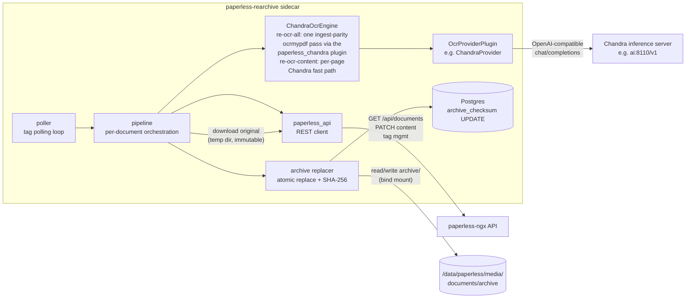

# paperless-rearchive

A tag-driven sidecar for [paperless-ngx](https://docs.paperless-ngx.com) that **re-OCRs documents
that are already in your library** with [Chandra](https://github.com/datalab-to/chandra), an LLM
vision OCR model — and optionally regenerates the document's *archive* (searchable PDF/A) version
with the exact same `ocrmypdf` pipeline paperless-ngx uses at ingest. Something the paperless-ngx
API deliberately does not let you do.

Tag a document `re-ocr-content` to replace its `content` field with fresh OCR markdown, or
`re-ocr-all` to additionally replace its archive file. The sidecar polls paperless for these tags
and processes tagged documents in the background.

> **This is the first public release (v1.0).** Both trigger paths have been verified end-to-end
> against a live instance. Design notes and the engineering log live in
> [`doc/PLANNING.md`](doc/PLANNING.md) and [`doc/OCR_STRATEGY.md`](doc/OCR_STRATEGY.md).

## Is this tool for you?

Re-OCR of an existing library is an invasive operation — it rewrites the `content` field and
*replaces archive files in paperless's media directory*. Before installing, check that you can
live with every item on this list:

- **You run paperless-ngx under docker compose.** The sidecar is a normal compose service next to
  `paperless`, `postgres`, and your OCR server. There is no bare-metal mode.
- **You have write access to paperless's archive directory.** The sidecar bind-mounts
  `media/documents/archive/` read-write and atomically replaces archive files in place. It must
  run as a user that may write those files (set the container's `user:` to the UID/GID that owns
  the archive files). Originals in `media/documents/originals/` are **never** touched — they are
  only downloaded read-only via the API.
- **You have a paperless-ngx API token.** The sidecar reads documents, patches the `content`
  field, and manages tags, notes and custom fields through the REST API. Create the token in
  paperless under *Admin → Documents → Tokens*.
- **You have direct PostgreSQL access** (needed for `re-ocr-all` only) — and your paperless runs
  **on PostgreSQL**. The sidecar talks to the database with `psycopg` only; paperless instances on
  SQLite (or the removed-in-2.0 MySQL) are not supported. The archive flow (`re-ocr-all`) reads
  the archive file's on-disk path and expected checksum from the database, re-verifies the
  checksum just before replacing the file (so it never races a concurrent modification), and
  updates the stored checksum afterwards — none of that has an API equivalent. **`re-ocr-content`
  runs never open a database connection.** Reuse the same `PAPERLESS_DB*` credentials paperless
  itself uses.
- **You have a running Chandra OCR server with an OpenAI-compatible API.** All inference happens
  there (typically [paperless-chandra](https://github.com/flobernd/paperless-chandra)'s server on
  a GPU box, e.g. `http://ai:8110/v1`). The sidecar container itself is CPU-only; it drives
  ocrmypdf with the Chandra plugin and talks to the server over `chat/completions`. The same
  server you (would) use for paperless-chandra ingest works as-is.
- **You are comfortable with the sidecar writing to your library.** Content and archive changes
  are recorded (audit note per run, provenance custom fields, `.bak` backups of replaced
  archives), but there is no undo button. Start with `REARCHIVE_DRY_RUN=true` and one test
  document.
- **You can provide a backup directory outside the archive tree** (mandatory). Before an archive
  is replaced, the old version is copied to `REARCHIVE_BACKUP_DIRECTORY` — the sidecar refuses to
  run without it, and refuses to run if it points into the archive tree. Ideally a separate bind
  mount (it may even be another disk; backups are *copied*).

If you just want Chandra OCR for **new** documents at ingest, you don't need this project — run
[paperless-chandra](https://github.com/flobernd/paperless-chandra) directly. paperless-rearchive
exists for the documents already in your library.

## How it works



For `re-ocr-all` the sidecar drives **one `ocrmypdf` pass** — the same invocation, parameters and
`paperless_chandra` plugin that paperless-chandra's ingest parser drives — producing the PDF/A
archive *and* the markdown `content` from a single OCR run, so a re-OCR'd document is
indistinguishable from a freshly ingested one. The OCR source is always the **immutable original**,
fetched with the `paperless-ngx` API.

## Usage: trigger tags

| Tag | Effect |
| --- | --- |
| `re-ocr-content` | Re-OCR run; the `content` field is replaced with the OCR output (markdown). No archive, no database access. |
| `re-ocr-all` | As above, **plus** the archive version is regenerated (same ocrmypdf pipeline as paperless ingest, Chandra as the OCR engine), atomically replacing the file in `media/documents/archive/` and updating `documents_document.archive_checksum` in the database. |

After processing, the trigger tag is removed and replaced with an outcome tag:

| Outcome | `re-ocr-content` documents | `re-ocr-all` documents |
| --- | --- | --- |
| Success | `re-ocr-content-success` | `re-ocr-all-success` |
| Failure | `re-ocr-content-failure` | `re-ocr-all-failure` |

A trigger tag is only replaced when the pipeline reached a decision; transient upstream errors
(OCR server unreachable, network hiccup) leave the trigger tag in place for the next poll cycle.

**No manual tag creation needed.** The sidecar creates both trigger tags automatically if they don't exist. Tag a document and wait for the next cycle (or [nudge the
poller](#manual-trigger-sighup)).

## Guarantees

- **The original file is immutable.** It is only ever downloaded via the `paperless-ngx` API into a scratch
  directory and used as the OCR source. Nothing ever writes to `media/documents/originals/`.
- Archive files are replaced **atomically** (write temp file → `os.replace`) and the previous
  archive version is kept as a `.bak-<timestamp>` file in `REARCHIVE_BACKUP_DIRECTORY` — a
  mandatory setting, outside the media directory (see
  [Backup directory](#backup-directory)).
- The archive is only replaced after verifying that the on-disk archive checksum still matches
  `documents_document.archive_checksum` (no concurrent modification).
- Born-digital PDFs without an archive version, and non-PDF originals (images), are handled in
  content-only mode — they have no archive file that could be regenerated in place.
- `REARCHIVE_DRY_RUN=true` performs the full OCR run and reports what *would* be written without
  touching paperless, the archives directory, or the database.

## OCR strategy: what happens to PDFs that already have text

`ocrmypdf` is the tool that adds the invisible, searchable OCR text layer to a scanned PDF. Its
key concept here is the **OCR mode**, which decides what to do with a PDF that *already* has a
text layer (e.g. from a previous OCR run): re-OCR it, leave it alone, or rip the pages apart and
start over. These modes — `--skip-text`, `--redo-ocr`, `--force-ocr` — are ocrmypdf's, not ours;
`paperless-ngx` wraps them in its own `PAPERLESS_OCR_MODE` setting
([docs](https://docs.paperless-ngx.com/configuration/#ocr-settings)), and `REARCHIVE_OCR_MODE`
uses the same vocabulary. Read the
[ocrmypdf cookbook](https://ocrmypdf.readthedocs.io/en/latest/cookbook.html#redo-existing-ocr)
for the full story; the short version:

| ocrmypdf mode | What it does to your PDF |
| --- | --- |
| *default / error* | Refuses to touch a PDF that already has text (this is why "which mode?" matters at all). |
| `--skip-text` | Leaves existing text alone; only OCRs pages that have **no** text. |
| `--redo-ocr` | **Strips the existing invisible text layer and re-OCRs**, keeping the original page images untouched. No re-rasterising, no quality loss, no bloat. |
| `--force-ocr` | **Rasterises every page** (re-renders the pixels at OCR resolution) and OCRs that. The nuclear option: fixes even text that was "baked into" the page image, but the archive grows several-fold and pixels are resampled. |

paperless-ngx additionally defines `auto` (pick skip/redo sensibly per page) and `off`
(PDF/A conversion only, no OCR).

`REARCHIVE_OCR_MODE` maps onto this (default **`redo`** — this is a re-OCR tool, after all):

| `REARCHIVE_OCR_MODE` | ocrmypdf behaviour | Archive size |
| --- | --- | --- |
| `redo` *(default)* | Always `--redo-ocr`: old text layer replaced, page images untouched. | ≈ unchanged |
| `auto` | Ingest semantics: OCRs only textless pages (`--skip-text`)… **except** that a PDF which already has a text layer is *upgraded to `redo`* — plain ingest semantics would make `auto` a no-op on exactly the documents this tool exists to process. | ≈ unchanged |
| `force` | Always `--force-ocr`: every page is re-rasterised. | **much larger** |
| `off` | No OCR at all: PDF/A conversion only (keeps whatever text layer exists). | ≈ unchanged |
| `skip`, `skip_noarchive` | Accepted for compatibility with old paperless values; treated as `auto`. | — |

OCR quality knobs (mirroring paperless's own settings):

- **`REARCHIVE_OCR_ROTATE_PAGES`** (default on): fixes 90/180/270° page orientation before OCR.
  Available in every mode. Orientation detection is provided by the Chandra engine plugin — since
  the LLM has no orientation classifier of its own, the plugin shells out to a **local Tesseract
  OSD probe** (`tesseract --psm 0`, no GPU involved) whenever ocrmypdf asks for a page's
  orientation.
- **`REARCHIVE_OCR_DESKEW`** (default on): fixes small (< 45°) crooked-scan skew. **ocrmypdf
  forbids deskew together with `--redo-ocr`** (it won't rasterise the page images deskew would
  need), so under the default `redo` mode deskew is silently skipped — the same limitation
  paperless itself has. Use `force` mode if straightening the pixels matters more than archive
  size.
- **`REARCHIVE_OCR_CLEAN`** (default `clean`): unpaper-based image cleaning before OCR. Under
  `redo` a "final" clean becomes a pre-OCR clean (ocrmypdf constraint again).
- **`REARCHIVE_OCR_OUTPUT_TYPE`** (default `pdfa`): archive flavour, exactly like
  `PAPERLESS_OCR_OUTPUT_TYPE`.
- **`REARCHIVE_OCR_USER_ARGS`**: a JSON escape hatch merged into the ocrmypdf arguments *last*,
  so it can override anything above — same purpose as paperless's `PAPERLESS_OCR_USER_ARGS`
  (e.g. `{"invalidate_digital_signatures": true, "continue_on_soft_render_error": true}`).

One consequence worth knowing: with `ocrmypdf` driving, a page Chandra cannot OCR fails the whole
document (with an ingest-style fallback retry in `force` mode) — per-page partial failures are not
a thing in archive mode. The `re-ocr-page-errors` tag therefore only appears on `re-ocr-content`
runs, where the sidecar's own per-page fast path is used.

## Setup (docker compose)

The sidecar is designed to live in the **same `docker-compose.yml` as paperless-ngx**, so it
shares paperless's network, its PostgreSQL instance, and its archive directory. Where `paperless`
in your compose file is `paperless`, `postgres` is `postgres`, and your Chandra server is
reachable at `http://ai:8110/v1` (adjust all three to your setup).

### 1. Get the code next to your compose file

```bash
cd /opt/paperless            # wherever your paperless-ngx docker-compose.yml lives
git clone https://github.com/<you>/paperless-rearchive.git
```

### 2. Add the service to `docker-compose.yml`

The sidecar belongs in the same compose file as paperless. Here is an abbreviated but complete
typical setup — paperless-ngx with its supporting services (postgres, valkey or redis, tika,
gotenberg) plus `paperless-rearchive`. Host paths use `/data/paperless/...` and UID/GID `1000`
as placeholders — match your existing paperless service. The Chandra inference server is
*not* part of this compose file; it runs elsewhere (here: `http://ai:8110/v1`).

```yaml
networks:
  frontend:
  backend:

secrets:
  paperless_db_paperless_passwd:
    file: ./secrets/paperless_db_paperless_passwd   # same file paperless uses
  paperless_secret_key:
    file: ./secrets/paperless_secret_key
  chandra_api_key:
    file: ./secrets/chandra_api_key                 # omit if server needs no auth
  paperless_api_token:
    file: ./secrets/paperless_api_token

services:
  # ─── PostgreSQL ────────────────────────────────────────────────────────────
  postgres:
    image: postgres:17
    container_name: postgres
    restart: unless-stopped
    networks: [backend]
    volumes:
      - /data/paperless/pgdata:/var/lib/postgresql/data
    environment:
      POSTGRES_DB: paperless
      POSTGRES_USER: paperless
      POSTGRES_PASSWORD_FILE: /run/secrets/paperless_db_paperless_passwd
    secrets: [paperless_db_paperless_passwd]

  # ─── Valkey (or redis) — paperless task queue / broker ─────────────────────
  valkey:
    image: valkey/valkey:8
    container_name: valkey
    restart: unless-stopped
    networks: [backend]

  # ─── Gotenberg — PDF/A conversion, office→PDF for paperless ────────────────
  gotenberg:
    image: gotenberg/gotenberg:8
    container_name: gotenberg
    restart: unless-stopped
    networks: [backend]
    command: ["gotenberg", "--chromium-disable-javascript=true"]

  # ─── Tika — text/metadata extraction for non-PDF documents ─────────────────
  tika:
    image: apache/tika:latest
    container_name: tika
    restart: unless-stopped
    networks: [backend]

  # ─── paperless-ngx (abbreviated — keep your existing settings) ─────────────
  paperless:
    # paperless-ngx with the Chandra OCR plugin wired in at ingest, built from
    # paperless-chandra's example Dockerfile. (With the stock paperless-ngx
    # image the PAPERLESS_CHANDRA_* options below would be ignored.)
    build:
      context: ./paperless-chandra/examples
      dockerfile: Dockerfile
      args:
        PLUGIN_REF: ${PLUGIN_REF:-master}     # paperless-chandra plugin ref
        PAPERLESS_TAG: ${PAPERLESS_TAG:-3.1.3}
    image: paperless
    container_name: paperless
    restart: unless-stopped
    networks: [frontend, backend]
    ports: ["8000:8000"]
    depends_on: [postgres, valkey, gotenberg, tika]
    volumes:
      - /data/paperless/data:/usr/src/paperless/data
      - /data/paperless/media:/usr/src/paperless/media
      - /data/paperless/consume:/usr/src/paperless/consume
    environment:
      USERMAP_UID: "1000"                # must match paperless-rearchive's user:
      USERMAP_GID: "1000"
      PAPERLESS_REDIS: redis://valkey:6379
      PAPERLESS_DBHOST: postgres
      PAPERLESS_DBNAME: paperless
      PAPERLESS_DBUSER: paperless
      PAPERLESS_DBPASS_FILE: /run/secrets/paperless_db_paperless_passwd
      PAPERLESS_SECRET_KEY_FILE: /run/secrets/paperless_secret_key
      PAPERLESS_TIKA_ENABLED: "1"
      PAPERLESS_TIKA_ENDPOINT: http://tika:9998
      PAPERLESS_TIKA_GOTENBERG_ENDPOINT: http://gotenberg:3000
      # Chandra at ingest (requires the paperless-chandra build above):
      PAPERLESS_CHANDRA_SERVER_URL: http://ai:8110/v1
      PAPERLESS_CHANDRA_MODEL_NAME: chandra-ocr-2-q8
      PAPERLESS_CHANDRA_API_KEY_FILE: /run/secrets/chandra_api_key
    secrets:
      - paperless_db_paperless_passwd
      - paperless_secret_key
      - chandra_api_key

  # ─── paperless-rearchive — tag-driven re-OCR sidecar ───────────────────────
  paperless-rearchive:
    build:
      context: ./paperless-rearchive
      dockerfile: docker/Dockerfile
    image: paperless-rearchive:latest
    container_name: paperless-rearchive
    restart: unless-stopped
    # MUST match the UID:GID that owns the files in paperless's archive
    # directory — i.e. the same value as paperless's USERMAP_UID/GID.
    user: "1000:1000"
    networks: [backend]
    depends_on:
      - paperless
    environment:
      # ---- required: where to find things -----------------------------------
      PAPERLESS_BASE_URL: "http://paperless:8000"     # paperless web UI/API
      PAPERLESS_API_TOKEN_FILE: /run/secrets/paperless_api_token
      # Chandra inference server (OpenAI-compatible /v1 API):
      PAPERLESS_CHANDRA_SERVER_URL: "http://ai:8110/v1"
      PAPERLESS_CHANDRA_MODEL_NAME: "chandra-ocr-2-q8"
      PAPERLESS_CHANDRA_API_KEY_FILE: /run/secrets/chandra_api_key
      # Database (re-ocr-all only) - copy from paperless's own environment:
      PAPERLESS_DBHOST: "postgres"
      PAPERLESS_DBPORT: "5432"
      PAPERLESS_DBNAME: "paperless"
      PAPERLESS_DBUSER: "paperless"
      PAPERLESS_DBPASS_FILE: /run/secrets/paperless_db_paperless_passwd
      # ---- required: paths inside THIS container ----------------------------
      REARCHIVE_ARCHIVE_DIR: "/archives"   # mount point of paperless's
                                           # media/documents/archive (below)
      # ---- optional, safe defaults shown; details in the reference below ----
      REARCHIVE_PROVIDER: "chandra"
      REARCHIVE_TRIGGER_TAG_CONTENT: "re-ocr-content"
      REARCHIVE_TRIGGER_TAG_ALL: "re-ocr-all"
      REARCHIVE_SUCCESS_SUFFIX: "-success"
      REARCHIVE_FAILURE_SUFFIX: "-failure"
      REARCHIVE_POLL_INTERVAL: "300"       # seconds between tag polls
      REARCHIVE_BATCH_LIMIT: "5"           # docs processed per cycle
      REARCHIVE_WRITE_PROVENANCE: "true"   # custom fields + audit notes
      REARCHIVE_DRY_RUN: "false"
      REARCHIVE_RUN_ONCE: "false"
      REARCHIVE_LOG_LEVEL: "INFO"
      REARCHIVE_MAX_PAGES: "0"             # 0 = all pages
      REARCHIVE_OCR_CONCURRENCY: "1"       # parallel pages (see reference)
      # --- OCR behaviour (mirrors PAPERLESS_OCR_*; see "OCR strategy") -------
      REARCHIVE_OCR_MODE: "redo"           # redo | auto | force | off
      REARCHIVE_OCR_CLEAN: "clean"         # clean | final | none
      REARCHIVE_OCR_DESKEW: "true"
      REARCHIVE_OCR_ROTATE_PAGES: "true"
      REARCHIVE_OCR_ROTATE_PAGES_THRESHOLD: "12.0"
      REARCHIVE_OCR_OUTPUT_TYPE: "pdfa"
      REARCHIVE_OCR_LANGUAGE: "eng"        # label only; Chandra is language-agnostic
      REARCHIVE_OCR_DPI: "300"             # content-only render DPI
      # REARCHIVE_OCR_USER_ARGS: '{"invalidate_digital_signatures": true, "continue_on_soft_render_error": true}'
      # REARCHIVE_ARCHIVE_FOR_IMAGES: "false"   # reserved; images are content-only today
      PAPERLESS_CHANDRA_CONTENT_FORMAT: "markdown"
      PAPERLESS_CHANDRA_MAX_OUTPUT_TOKENS: "12384"
      # ---- required: backup location (must NOT be inside /archives) --------
      REARCHIVE_BACKUP_DIRECTORY: "/archive-backups"   # see Backup directory
    volumes:
      # Read-write: archive files are replaced here. Use the SAME host path
      # your paperless container mounts at media/documents/archive.
      - /data/paperless/media/documents/archive:/archives
      # Required: where .bak backups of replaced archives are kept. May be a
      # different disk than the archive mount (backups are copied).
      - /data/paperless/archive-backups:/archive-backups
    secrets:
      - chandra_api_key
      - paperless_db_paperless_passwd
      - paperless_api_token
    logging:
      driver: "json-file"
      options:
        max-size: "10m"
        max-file: "3"
```

> **Find your archive path:** in paperless's compose service it is the volume mounted at
> `/usr/src/paperless/media` — the archive directory is `…/media/documents/archive` on the host.
> Mount exactly that directory (not its parent) read-write.


### 3. Build and start

```bash
docker compose build paperless-rearchive
docker compose up -d paperless-rearchive
docker compose logs -f paperless-rearchive   # watch the first cycles
```

### 4. First test

1. Set `REARCHIVE_DRY_RUN: "true"` first if you want a no-write rehearsal.
2. Tag one **disposable test document** `re-ocr-all` in the paperless UI.
3. Wait for a poll cycle (or `docker kill -s HUP paperless-rearchive`).
4. Check the outcome: the document should carry `re-ocr-all-success`, its `content` field fresh
   markdown, and an audit note; the archive file's `Creator` metadata should read
   `OCRmyPDF … / Chandra …`. The old archive is kept as `.bak-<timestamp>` **in
   `REARCHIVE_BACKUP_DIRECTORY`** — never in the archive directory.

## Secrets

Three values are sensitive: the paperless API token, the Chandra API key, and the database
password (plus, optionally, the database user). All of them — including the API token — can be
supplied three different ways. Pick **one way for all of them**, or mix and match per credential;
nothing in the sidecar cares which you choose.

### Way 1: plain values (`environment:` or a compose env file)

The simplest option — the value sits in the compose file (or in a file referenced by `env_file:`):

```yaml
services:
  paperless-rearchive:
    image: paperless-rearchive:latest
    environment:
      PAPERLESS_API_TOKEN: "paste-your-paperless-api-token-here"
      PAPERLESS_CHANDRA_API_KEY: "paste-your-chandra-api-key-here"   # omit if no auth needed
      PAPERLESS_DBPASS: "your-postgres-password-for-paperless"
```

Fine for a single-operator instance where the compose file is already private. Values in a
separate env file (referenced via `env_file:`) are equally injected into the container — see
[`doc/deploy/env.example`](doc/deploy/env.example).

> ℹ️ Compose interpolation `${…}` in the YAML is resolved from the project's root `.env` (or the
> shell) **before** any `env_file:` is read — so you cannot `${…}`-reference a value that lives
> in an env file. If you want file-based secrets, use Way 2 or 3.

### Way 2: `_FILE` variables pointing at a file

For every credential `NAME`, the sidecar understands a `NAME_FILE` environment variable whose
content is the secret. This works for **all four** credentials:

| Plain variable | File variant | Used for |
| --- | --- | --- |
| `PAPERLESS_API_TOKEN` | `PAPERLESS_API_TOKEN_FILE` | paperless REST API token |
| `PAPERLESS_CHANDRA_API_KEY` | `PAPERLESS_CHANDRA_API_KEY_FILE` | Chandra server API key |
| `PAPERLESS_DBPASS` | `PAPERLESS_DBPASS_FILE` | PostgreSQL password |
| `PAPERLESS_DBUSER` | `PAPERLESS_DBUSER_FILE` | PostgreSQL user |

The file can be anywhere the container can read — e.g. a bind mount:

```yaml
services:
  paperless-rearchive:
    image: paperless-rearchive:latest
    volumes:
      - /data/paperless/secrets:/run/secrets:ro
    environment:
      PAPERLESS_API_TOKEN_FILE: /run/secrets/paperless_api_token
      PAPERLESS_CHANDRA_API_KEY_FILE: /run/secrets/chandra_api_key
      PAPERLESS_DBPASS_FILE: /run/secrets/paperless_db_paperless_passwd
```

If both the plain variable and its `_FILE` variant are set, **the `_FILE` variant wins**.

### Way 3: docker compose `secrets:` (paperless-ngx convention)

Docker's `secrets:` section mounts files at `/run/secrets/<name>` inside the container; consume
them with the same `_FILE` variables. This is exactly how paperless-ngx itself consumes
`PAPERLESS_DBPASS_FILE`, and it keeps secret values out of the compose file and out of
`docker inspect` output:

```yaml
secrets:
  paperless_api_token:
    file: ./secrets/paperless_api_token
  chandra_api_key:
    file: ./secrets/chandra_api_key
  paperless_db_paperless_passwd:
    file: ./secrets/paperless_db_paperless_passwd

services:
  paperless-rearchive:
    image: paperless-rearchive:latest
    environment:
      PAPERLESS_API_TOKEN_FILE: /run/secrets/paperless_api_token
      PAPERLESS_CHANDRA_API_KEY_FILE: /run/secrets/chandra_api_key
      PAPERLESS_DBPASS_FILE: /run/secrets/paperless_db_paperless_passwd
    secrets:
      - paperless_api_token
      - chandra_api_key
      - paperless_db_paperless_passwd
```

This is what the full-stack example in [Setup](#setup-docker-compose) uses.

Notes: surrounding whitespace in secret files is stripped (a trailing newline from `echo` is
fine); the database **user** name can also be file-based via `PAPERLESS_DBUSER_FILE` if you
prefer. A runnable variant lives in
[`doc/deploy/compose-snippet.yml`](doc/deploy/compose-snippet.yml).

## Configuration reference

Booleans accept `true/false/yes/on/1`. Everything below can be set in the compose `environment:`
block; the compose example above already lists all of them with defaults.

### Paperless connection

| Variable | Default | Purpose |
| --- | --- | --- |
| `PAPERLESS_BASE_URL` | `http://paperless:8000` | Base URL of the paperless web server (REST API is `<url>/api/`). Use the *service name* from your compose file, not `localhost`. |
| `PAPERLESS_API_TOKEN` / `PAPERLESS_API_TOKEN_FILE` | *(required)* | API token created in paperless (Admin → Documents → Tokens). Needs read access to documents, write access to content/tags/notes/custom fields. |

### Chandra inference server

| Variable | Default | Purpose |
| --- | --- | --- |
| `PAPERLESS_CHANDRA_SERVER_URL` | *(required)* | Base URL of an OpenAI-compatible server hosting the Chandra model, e.g. `http://ai:8110/v1`. The sidecar appends `/v1` when missing, same as paperless-chandra. |
| `PAPERLESS_CHANDRA_MODEL_NAME` | `chandra` | The model name the server advertises (`/v1/models`). |
| `PAPERLESS_CHANDRA_API_KEY` / `…_FILE` | *(empty)* | Bearer token for the server; leave unset if the server needs no auth. |
| `PAPERLESS_CHANDRA_CONTENT_FORMAT` | `markdown` | Format of the OCR text stored in paperless: `markdown` (recommended) or `text`. |
| `PAPERLESS_CHANDRA_MAX_OUTPUT_TOKENS` | `12384` | Per-page output token budget for the model. |

### OCR behaviour (mirrors paperless's `PAPERLESS_OCR_*`)

| Variable | Default | Purpose |
| --- | --- | --- |
| `REARCHIVE_PROVIDER` | `chandra` | OCR provider plugin. Only `chandra` exists today. |
| `REARCHIVE_OCR_MODE` | `redo` | How existing text layers are treated — see [OCR strategy](#ocr-strategy-what-happens-to-pdfs-that-already-have-text). Values: `redo`, `auto`, `force`, `off` (legacy `skip`/`skip_noarchive` accepted as `auto`). |
| `REARCHIVE_OCR_CLEAN` | `clean` | unpaper image cleaning before OCR: `clean` (pre-OCR), `final` (post-OCR; becomes pre-OCR under `redo`, as at ingest), `none`. |
| `REARCHIVE_OCR_DESKEW` | `true` | Fix small skew (< 45°) before OCR. Silently skipped under `redo` mode (ocrmypdf constraint, same as paperless). |
| `REARCHIVE_OCR_ROTATE_PAGES` | `true` | Fix 90/180/270° page orientation before OCR. Detection: Tesseract OSD, run locally by the Chandra engine plugin (ocrmypdf asks its OCR engine for orientation). |
| `REARCHIVE_OCR_ROTATE_PAGES_THRESHOLD` | `12.0` | Confidence threshold for rotation; lower = more aggressive (same meaning as paperless's `PAPERLESS_OCR_ROTATE_PAGES_THRESHOLD`). |
| `REARCHIVE_OCR_OUTPUT_TYPE` | `pdfa` | Output format of the regenerated archive (`pdfa`, `pdfa-1`, `pdfa-2`, `pdfa-3`, `pdf`), like `PAPERLESS_OCR_OUTPUT_TYPE`. |
| `REARCHIVE_OCR_LANGUAGE` | `eng` | Language label passed through to ocrmypdf (e.g. `eng+deu`). Chandra itself is language-agnostic; this mainly labels the text layer. |
| `REARCHIVE_OCR_USER_ARGS` | *(unset)* | JSON object of extra ocrmypdf kwargs, merged **last** — can override any of the above (same escape hatch as `PAPERLESS_OCR_USER_ARGS`). |
| `REARCHIVE_OCR_DPI` | `300` | Render resolution for the **content-only** fast path (PyMuPDF renders pages before the Chandra call). Archive runs rasterise inside ocrmypdf instead. |
| `REARCHIVE_MAX_PAGES` | `0` | `0` = OCR all pages; `N` = only the first N pages per document (archive runs get `pages=1-N`, and content then comes from the PDF text layer rather than markdown). |
| `REARCHIVE_OCR_CONCURRENCY` | `1` | Pages sent to the Chandra server concurrently per document. ⚠️ A local vision LLM is GPU-bound: >1 does not create more GPU, it piles competing requests onto the same server (higher per-page latency, timeout/OOM risk). Raise gradually (2, then 4) and watch the GPU. |
| `REARCHIVE_ARCHIVE_FOR_IMAGES` | `false` | Reserved. Non-PDF originals are always handled content-only today. |

### Tags, loop and safety

| Variable | Default | Purpose |
| --- | --- | --- |
| `REARCHIVE_TRIGGER_TAG_CONTENT` | `re-ocr-content` | Trigger tag for content-only runs (auto-created). |
| `REARCHIVE_TRIGGER_TAG_ALL` | `re-ocr-all` | Trigger tag for content+archive runs (auto-created). |
| `REARCHIVE_SUCCESS_SUFFIX` | `-success` | Outcome tag suffix appended to the trigger tag name on success. |
| `REARCHIVE_FAILURE_SUFFIX` | `-failure` | Outcome tag suffix on failure. |
| `REARCHIVE_POLL_INTERVAL` | `300` | Seconds between poll cycles. |
| `REARCHIVE_BATCH_LIMIT` | `5` | Maximum documents processed per cycle (more stay tagged for the next cycle). |
| `REARCHIVE_ARCHIVE_DIR` | `/archives` | Inside the container: where paperless's archive directory is mounted. Must match the `volumes:` entry. |
| `REARCHIVE_BACKUP_DIRECTORY` | *(required)* | Where `.bak-<timestamp>` backups of replaced archives are kept. Must be outside the archive tree (the sidecar refuses to start otherwise) — see [Backup directory](#backup-directory). |
| `REARCHIVE_WRITE_PROVENANCE` | `true` | Write provenance custom fields (`OCR engine`, `OCR date`, `OCR pages`, `OCR archive ratio`) and append an audit note per run. Skipped in dry-run. |
| `REARCHIVE_DRY_RUN` | `false` | Full OCR run, but nothing is written: no content PATCH, no archive replacement, no DB update, no tag changes (trigger tags must already exist). |
| `REARCHIVE_RUN_ONCE` | `false` | Exit after one poll cycle (useful for cron-style or CI usage). |
| `REARCHIVE_LOG_LEVEL` | `INFO` | `DEBUG` shows the effective ocrmypdf arguments (API key masked). |

### Database (re-ocr-all only)

**PostgreSQL only** (the sidecar uses `psycopg`). paperless-ngx also runs on SQLite out of the
box; if yours does, `re-ocr-content` still works but `re-ocr-all` cannot. Copy the values from
paperless's own environment.

| Variable | Default | Purpose |
| --- | --- | --- |
| `PAPERLESS_DBHOST` | `postgres` | PostgreSQL host (compose service name). |
| `PAPERLESS_DBPORT` | `5432` | PostgreSQL port. |
| `PAPERLESS_DBNAME` | `paperless` | Database name. |
| `PAPERLESS_DBUSER` / `…_FILE` | `paperless` | Database user. |
| `PAPERLESS_DBPASS` / `…_FILE` | *(required)* | Database password. |

## OCR provenance

On every successful run the sidecar records machine-readable provenance in
[paperless-ngx custom fields](https://docs.paperless-ngx.com/usage/#custom-fields),
visible on the document and filterable in saved views:

| Field | Type | Example | Written when |
| --- | --- | --- | --- |
| `OCR engine` | string | `chandra-ocr-2-q8` | every success |
| `OCR date` | date | `2026-09-17` | every success |
| `OCR pages` | string | `4/4 ok` | every success |
| `OCR archive ratio` | float | `1.001` | `re-ocr-all` only |

Field definitions are auto-created once via the API — no manual setup. Because custom fields only
keep the latest state, every run also appends an **audit note** (`POST /api/documents/{id}/notes/`)
with the engine, page outcome, archive size ratio and OCR duration — and a `Re-OCR failed (…)`
note on failure. Both are skipped in dry-run mode and when `REARCHIVE_WRITE_PROVENANCE=false`;
a provenance failure never fails the document.

## Manual trigger (SIGHUP)

The polling loop runs on `REARCHIVE_POLL_INTERVAL` (default 300 s). To trigger an immediate poll:

```bash
docker kill -s HUP paperless-rearchive
```

The handler is lightweight — it interrupts the sleep and runs a single poll cycle; it does not
reset the interval timer or disrupt an in-flight OCR run. A signal arriving *while a cycle is
already running* is honoured immediately after that cycle finishes (it is not swallowed).

## Backup directory

`REARCHIVE_BACKUP_DIRECTORY` is a **mandatory setting**: before an archive is replaced, the
current version is copied there as `<name>.bak-<timestamp>`. It must be a **different directory
than `REARCHIVE_ARCHIVE_DIR`** — ideally a **separate bind mount**, which may even be a different
disk (backups are *copied*, not moved):

```yaml
services:
  paperless-rearchive:
    image: paperless-rearchive:latest
    volumes:
      - /opt/paperless/media/documents/archive:/archives
      - /opt/paperless/archive-backups:/archive-backups   # different directory / disk
    environment:
      REARCHIVE_ARCHIVE_DIR: "/archives"
      REARCHIVE_BACKUP_DIRECTORY: "/archive-backups"
```

The archive's sub-directory layout is mirrored below the backup directory. Backups are
**unconditional** — every archive replacement creates one; there is no option to skip it. The
sidecar **refuses to start** without the setting, when it resolves to the archive directory or a
sub-directory of it (symlinks included), when the path exists but is not a directory, or when it
is not writable — it creates the directory on startup if needed. And as a runtime backstop, the
replacer refuses to write any backup whose destination resolves inside the archive directory, even
if a symlink game changes the picture after startup. Without all of this, paperless-ngx's health
check reports every backup in the media directory as an orphaned file:

> `[WARNING] [paperless.sanity_checker] Orphaned file in media dir: …/documents/archive/….pdf.bak-…`

Existing `.bak-*` files in the archive directory (from earlier versions) can be moved to the
backup directory (or deleted) to clear those warnings.

## Status

| Component | State |
| --- | --- |
| Tag poller (SIGHUP wake, batching, error isolation) | ✅ done + verified live |
| `paperless_api` client (original download, content PATCH, tag swap, notes, custom fields) | ✅ done + verified live |
| Ingest-parity OCR: one ocrmypdf pass via the `paperless_chandra` plugin (archive + content) | ✅ done + verified live |
| Content-only fast path (per-page Chandra, `re-ocr-page-errors` tracking) | ✅ done + verified live |
| Archive replacer (checksum verify, `.bak` backups, atomic replace, DB checksum update) | ✅ done + verified live |
| Dockerfile (CPU-only; ghostscript/tesseract/unpaper/jbig2/pngquant) | ✅ done |
| Unit tests | ✅ 97 passing |
| Failed-scan detection (Chandra repeat-loop heuristics) | ⬜ open — see PLANNING Risks |
| Bulk re-OCR rehearsal guidance before mass use | ⬜ open |

## Development & design docs

- [`doc/PLANNING.md`](doc/PLANNING.md) — phased engineering plan, research notes, config table, risks.
- [`doc/OCR_STRATEGY.md`](doc/OCR_STRATEGY.md) — how the sidecar's OCR relates to paperless ingest,
  and how parity was established and verified.
- `tests/` — unit tests (`pytest`); `tests/integration/` — live-instance helpers, including
  `check_archive_provenance.sh`, which reports which OCR engine produced each archive's text layer
  (exit 0 = every checked archive is Chandra).

The OCR engine is pluggable (`OcrProviderPlugin`): `ChandraProvider` wraps paperless-chandra's
ocrmypdf plugin today; further LLM providers (own OCR output → text layer + content) can be added
behind the same interface.

## License

MIT — see [`LICENSE`](LICENSE).


