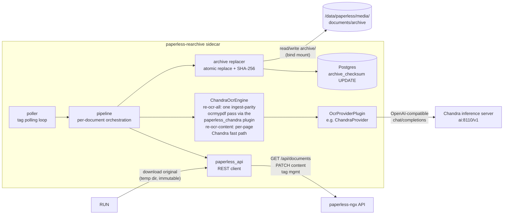
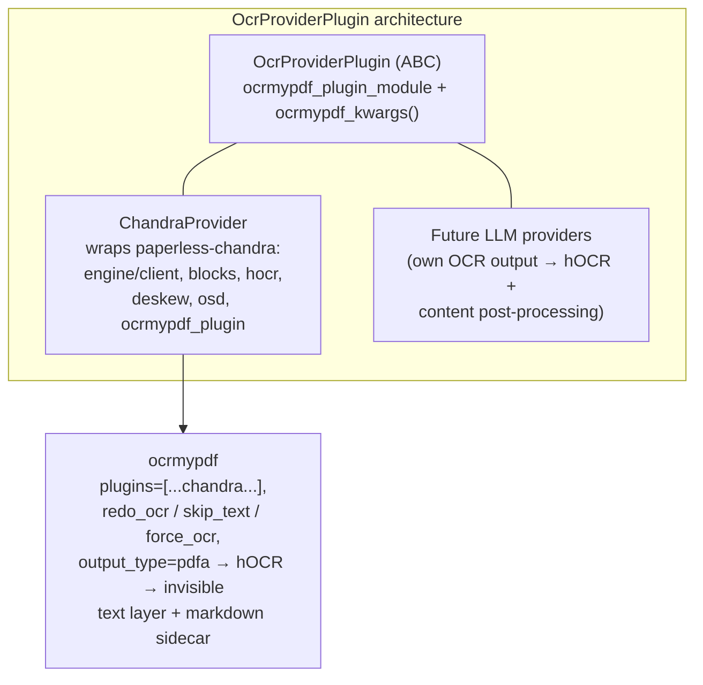

# paperless-rearchive

A tag-driven sidecar for [paperless-ngx](https://github.com/paperless-ngx/paperless-ngx) that
re-OCRs existing documents with state-of-the-art LLM vision OCR and (optionally) regenerates the
archive version of a document — something the paperless-ngx API does not allow.

It reuses the OCR/hOCR/pipeline code from
[paperless-chandra](https://github.com/flobernd/paperless-chandra) and drives `ocrmypdf` with the
same paperless-chandra ocrmypdf plugin that new documents are ingested with, so re-processed
documents get *identical* quality and PDF/A output as fresh ingestions.

> **Status: functional.** Both trigger paths have been verified end-to-end against a live
> instance (see [`doc/PLANNING.md`](doc/PLANNING.md) for the phased checklist and remaining
> open items). The status table below is kept up to date as the project evolves.

## How it works



## Trigger tags

| Tag | Effect |
| --- | --- |
| `re-ocr-content` | Re-OCR run; `content` field is replaced with the OCR output (markdown). |
| `re-ocr-all` | As above, **plus** the archive version of the document is regenerated (same ocrmypdf pipeline as paperless, with the paperless-chandra plugin), atomically replacing the file in `media/documents/archive/` and updating `documents_document.archive_checksum` in the database. |

After processing, the trigger tag is removed and replaced with:

| Outcome | `re-ocr-content` documents | `re-ocr-all` documents |
| --- | --- | --- |
| Success | `re-ocr-content-success` | `re-ocr-all-success` |
| Failure | `re-ocr-content-failure` | `re-ocr-all-failure` |

A trigger tag is only replaced when the pipeline reached a decision; transient upstream errors
(OCR server unreachable, network hiccup) leave the trigger tag in place for the next poll cycle.

## OCR provenance (custom fields)

On every successful run the sidecar records machine-readable provenance in
[paperless-ngx custom fields](https://docs.paperless-ngx.com/usage/#custom-fields),
visible on the document and filterable in saved views:

| Field | Type | Example | Written when |
| --- | --- | --- | --- |
| `OCR engine` | string | `chandra-ocr-2-q8` | every success |
| `OCR date` | date | `2026-09-16` | every success |
| `OCR pages` | string | `4/4 ok` or `3/4 ok (errors: 3)` | every success |
| `OCR archive ratio` | float | `1.001` | `re-ocr-all` only |

Field definitions are auto-created once via `POST /api/custom_fields/` (same
pattern as trigger tags — no manual setup). Values are upserted with a single
`PATCH /api/documents/{id}/ {"custom_fields": [{"field": id, "value": …}]}`,
so re-running just overwrites ("latest state wins").

**Audit note (run history).** Because custom fields only keep the latest
state, every run also appends an audit note via
`POST /api/documents/{id}/notes/` — the append-only history — containing the
engine, page outcome, archive size ratio and OCR duration, plus a
`Re-OCR failed (<trigger>) …` note when a run ends in failure. Notes and
custom fields share the same gate: both are skipped in dry-run mode and when
`REARCHIVE_WRITE_PROVENANCE=false`, and a provenance failure never fails the
document.

**No manual tag creation needed.** The sidecar automatically creates both trigger tags
(`re-ocr-content` and `re-ocr-all`) via the paperless-ngx API on every poll cycle if they
don't already exist. You can tag documents immediately after starting the container — there's
no setup step to create the tags first. If the tags are ever accidentally deleted, they'll be
recreated on the next poll.

## Manual tag poll trigger (SIGHUP)

The tag polling loop runs on a configurable interval (`REARCHIVE_POLL_INTERVAL`, default 300 seconds).
To trigger an immediate poll without waiting for the next interval, send `SIGHUP` to the container:

```bash
docker kill -s HUP paperless-rearchive
```

This causes the poller to wake up and run an immediate tag scan, picking up any newly added trigger
tags right away. The SIGHUP handler is deliberately lightweight — it interrupts the current sleep and
triggers a single poll cycle; it does **not** reset the interval timer or disrupt an in-flight OCR run.
A signal that arrives *while a cycle is already running* is honoured immediately after that cycle
finishes (it is no longer silently swallowed).

This is useful when you've just tagged a batch of documents and don't want to wait for the next poll
cycle to begin processing.

## Guarantees

- **The original file is immutable.** It is only ever downloaded via the API into a scratch
  directory and used as the OCR source. Nothing ever writes to `media/documents/originals/`.
- Archive files are replaced **atomically** (write temp file → `os.replace`) and the previous
  archive version is kept as a `.bak-<timestamp>` file. By default that backup sits next to the
  archive; set `REARCHIVE_BACKUP_DIRECTORY` to keep it outside the media directory instead — see
  [Backup directory](#backup-directory).
- The archive is only replaced after verifying that the on-disk archive checksum still matches
  `documents_document.archive_checksum` (no concurrent modification).
- Born-digital PDFs without an archive version, and non-PDF originals (images), are handled in
  content-only mode — they have no archive file that could be regenerated in place.
- `DRY_RUN=true` performs the full OCR run and reports what would be written without touching
  paperless, the archives directory, or the database (tags must already exist).

## OCR strategy

Re-OCR must **replace** the old text layer without re-rendering the scan, otherwise a 600 KiB
archive can balloon to several MiB. `REARCHIVE_OCR_MODE` controls how `ocrmypdf` is invoked:

| Mode | Behaviour | Archive size |
| --- | --- | --- |
| `auto` (default) | `redo_ocr` when the original already has a text layer (swaps the invisible text layer, page images untouched); `skip_text` when it has none (OCRs only the bare pages). | ≈ unchanged |
| `redo` | Always `redo_ocr`. | ≈ unchanged |
| `force` | Always `force_ocr` — rasterises every page at ~400 dpi. | **much larger** |

`force` is a last resort for text baked into the page content instead of a text layer. Note that
`ocrmypdf` rejects `redo_ocr` together with `deskew`; the runner detects this, logs a warning and
drops deskew rather than silently switching to the size-destroying `force_ocr` path.

### Unified OCR architecture

The sidecar uses a **unified Chandra OCR engine** (`ocr/chandra_engine.py`) that produces both
markdown content and hOCR structures in a single pass:

1. **Render PDF pages** to images using PyMuPDF
2. **Call Chandra** for OCR on each page (produces both markdown and hOCR)
3. **Combine** all page markdown into final content

The PDF/A assembly is **optional** and only performed for `re-ocr-all`:

- **`re-ocr-content`**: Only markdown is used (no PDF/A generated) - saves CPU cycles
- **`re-ocr-all`**: Markdown + hOCR → ocrmypdf sandwich pipeline → searchable PDF/A

This avoids wasting CPU cycles on PDF/A generation for content-only mode, where only the markdown
is needed for the content field. The branching decision is made after OCR completion based on the
trigger tag.

**Page-level error handling:** If some pages fail OCR while others succeed, a `re-ocr-page-errors`
tag is added alongside the outcome tag. This allows operators to identify documents with partial OCR
for future fine-tuning.

The OCR source is always the **immutable original**, fetched with the API's
`?original=true` parameter — `/api/documents/{id}/download/` without it returns the *archive*.

## Status

Living checklist — updated as the project progresses. Full detail in
[`doc/PLANNING.md`](doc/PLANNING.md).

| Component | State |
| --- | --- |
| Parser-plugin-free tag poller (SIGHUP wake, batching, error isolation) | ✅ done + verified live |
| `paperless_api` client (tag lookup via `name__iexact`, original download, content PATCH, tag swap) | ✅ done + verified live |
| `paperless_rearchive/ocr` runner (Django-free ocrmypdf call, mode selection, guards) | ✅ done + verified live |
| `OcrProviderPlugin` ABC + provider registry | ✅ done |
| `ChandraProvider` (wraps paperless-chandra ocrmypdf plugin) | ✅ done + verified live |
| `archive/replacer` (checksum verify, `.bak`, atomic `os.replace`, SHA-256) | ✅ done + verified live |
| `archive/db` (psycopg `archive_checksum` read/update) | ✅ done + verified live |
| `re-ocr-content` end-to-end (content PATCH, archive untouched) | ✅ verified on live instance |
| `re-ocr-all` end-to-end (archive replace + DB checksum + tag swap) | ✅ verified on live instance |
| Dockerfile (`python:3.14-slim`/trixie, jbig2/pngquant/ghostscript/tesseract) | ✅ builds |
| Unit tests | ✅ 70 passing |
| Repeat-loop / failed-scan detection | ⬜ open (see PLANNING Risks) |
| Bulk re-OCR rehearsal before mass use | ⬜ open |

## Deployment

Build and add the service to `paperless-lxc/docker-compose.yml`
(see [`doc/deploy/compose-snippet.yml`](doc/deploy/compose-snippet.yml) for the full snippet):

```yaml
  paperless-rearchive:
    build: ../paperless-rearchive
    image: paperless-rearchive:latest
    container_name: paperless-rearchive
    restart: unless-stopped
    user: "1001:1001"
    networks:
      - backend
    env_file:
      - .env.paperless-rearchive
    secrets:
      - chandra_api_key
      - paperless_db_paperless_passwd
    volumes:
      - /data/paperless/media/documents/archive:/archives
    environment:
      PAPERLESS_BASE_URL: "http://paperless:8000"
      REARCHIVE_ARCHIVE_DIR: "/archives"
      PAPERLESS_CHANDRA_SERVER_URL: "http://ai:8110/v1"
      PAPERLESS_CHANDRA_MODEL_NAME: "chandra-ocr-2-q8"
      PAPERLESS_CHANDRA_CONTENT_FORMAT: "markdown"
```

### Backup directory

By default the previous archive version is kept next to the archive as `<name>.bak-<timestamp>`.
paperless-ngx's **health check** walks `PAPERLESS_MEDIA_ROOT` and cannot tell those sidecar
backups apart from orphaned files, so it logs warnings such as:

> `[WARNING] [paperless.sanity_checker] Orphaned file in media dir: …/documents/archive/….pdf.bak-20260916-051453`

Set `REARCHIVE_BACKUP_DIRECTORY` to move the backups out of the media directory. It must be a
**different directory than `REARCHIVE_ARCHIVE_DIR`** — ideally a **separate bind mount**, which may
even be a different disk (backups are *copied*, not moved):

```yaml
    volumes:
      - /data/paperless/media/documents/archive:/archives
      - /data/paperless/archive-backups:/archive-backups   # different directory / disk
    environment:
      REARCHIVE_ARCHIVE_DIR: "/archives"
      REARCHIVE_BACKUP_DIRECTORY: "/archive-backups"
```

The archive's sub-directory layout is mirrored below the backup directory, e.g.
`/archive-backups/Passports_Visas_IDs/DE/1971/<name>.pdf.bak-20260916-051453`. At startup the
sidecar creates the directory if needed, verifies it is writable, and **refuses to run** when
`REARCHIVE_BACKUP_DIRECTORY` resolves to the archive directory or a sub-directory of it (symlinks
included). If backups next to the archives are really what you want, omit
`REARCHIVE_BACKUP_DIRECTORY` — that is the legacy behaviour — but note that it still triggers the
orphaned-file warning; keeping the backups outside the media directory is what we recommend.
Existing `.bak-*` files already in the archive directory can be moved to the backup directory (or
deleted) to clear those warnings.

Configuration is documented in [`doc/PLANNING.md#configuration`](doc/PLANNING.md#configuration).

**Secrets:** every credential can be provided either inline (in `.env.paperless-rearchive`) or
via a secret file using the paperless-ngx `_FILE` convention — `PAPERLESS_API_TOKEN_FILE`,
`PAPERLESS_CHANDRA_API_KEY_FILE`, `PAPERLESS_DBPASS_FILE`, `PAPERLESS_DBUSER_FILE`. The `_FILE`
variant wins when both are set. See `doc/deploy/compose-snippet.yml` for a `_FILE`-based example.

## Components



## License

MIT — see [`LICENSE`](LICENSE).

