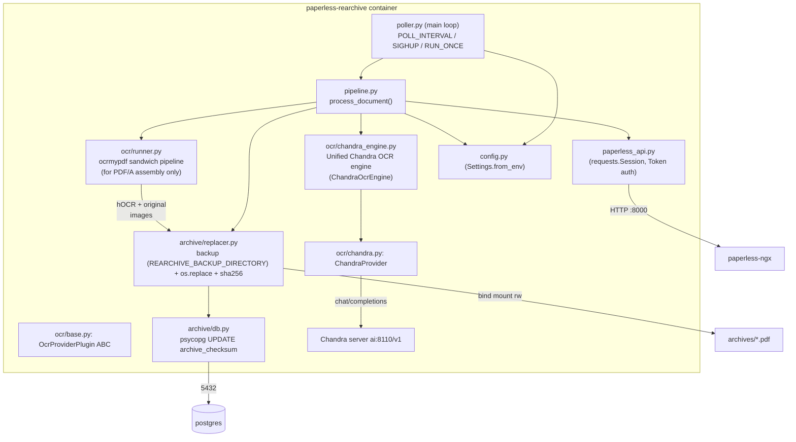
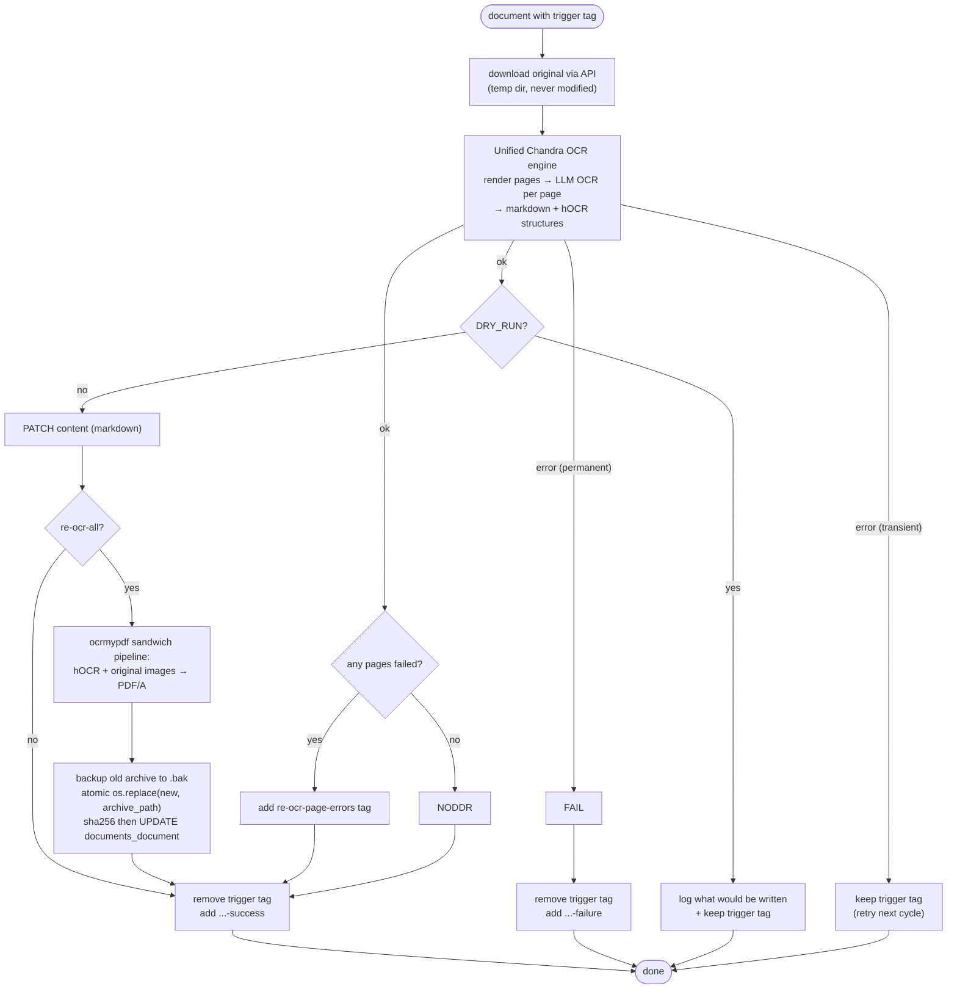

# paperless-rearchive — Planning

Working plan for the tag-driven re-OCR sidecar. This document is the source of truth for coding
agents; keep it up to date as phases complete. Status markers: ⬜ todo, 🔧 in progress, ✅ done.

## 1. Goal

Re-process the OCR of thousands of existing paperless-ngx documents using LLM vision OCR
(Chandra via the paperless-chandra ocrmypdf plugin), driven by tags:

- `re-ocr-content` — re-OCR, replace the document `content` field with the OCR output (markdown).
- `re-ocr-all` — as above, plus regenerate the archive version of the document and update the
  database checksum.

- `re-ocr-page-errors` — added alongside `-success` or `-failure` when a document has partial OCR
  results (some pages succeeded, some failed). This tag signals that the document has OCR content
  but with gaps that may need manual review or re-processing.
The original file is immutable; it is only downloaded via the API and used as OCR source.

## 2. Research notes (confirmed against paperless-ngx source / docs)

- **Unified OCR architecture** (Phase 3b, in progress): The OCR engine now uses a single Chandra pass
  that produces both markdown content and hOCR structures. For `re-ocr-content`, only the markdown is
  used (no PDF/A generated). For `re-ocr-all`, the hOCR is passed to ocrmypdf's sandwich pipeline
  to produce the searchable PDF/A from the original scan images. This avoids wasting CPU on PDF/A
  generation for content-only mode. The branching decision is made after OCR completion based on the
  trigger tag. Implemented in `paperless_rearchive/ocr/chandra_engine.py` (ChandraOcrEngine class).
  PDF/A assembly always uses ocrmypdf's sandwich pipeline for maximum compatibility and PDF/A compliance.
  `documents.utils.compute_checksum` — **SHA-256** of the file bytes (verified live: the
  on-disk file's SHA-256 matches the DB value exactly; earlier paperless releases used MD5)
  when the archive is moved into `settings.ARCHIVE_DIR`. Correct update statement:
  `UPDATE documents_document SET archive_checksum = '<sha256>' WHERE id = <id>;`
- **Archive directory**: `media/documents/archive/` (singular) on this deployment, with
  template-derived subdirectories (e.g. `Retirement/Steffen Richter/2026/…pdf`);
  246 of 5352 documents have no archive file.
- **Orphaned-file health check vs. backups**: paperless-ngx's sanity checker walks
  `PAPERLESS_MEDIA_ROOT` and flags every file it cannot account for, so the sidecar's
  `.bak-<timestamp>` copies sitting in `media/documents/archive/` surface as
  `Orphaned file in media dir: …/documents/archive/….pdf.bak-…` warnings. Hence
  `REARCHIVE_BACKUP_DIRECTORY`: backups go outside the media dir (typically a separate bind
  mount, possibly another disk - they are *copied*, so cross-device is fine), and startup
  refuses to run when the setting resolves into the archive tree.
- **Archive filename / path**: *not* always `<id>.pdf`. `file_handling.generate_unique_filename(
  doc, archive_filename=True)` derives it from storage-path / `PAPERLESS_FILENAME_FORMAT`
  templates (or `<pk:07>.pdf` when no template). The API's `archived_file_name` is only a
  **flattened display name** (e.g. `2026-01-07 Immigration US re-archive-test.pdf`) and does
  **not** give the on-disk location. The real relative path lives only in the DB column
  `documents_document.archive_filename` (e.g.
  `Passports_Visas_IDs/DE/2026/2026-01-07_re-archive-test.pdf`); the sidecar resolves it via
  `archive/db.py: fetch_archive_filename` and never reconstructs it from the document id.
- **Born-digital PDFs**: in `auto` mode paperless skips OCR for PDFs with an existing text layer
  (`skip_text`, `pdf_born_digital_text`); `PAPERLESS_ARCHIVE_FILE_GENERATION`
  (`never`/`only`/`always`) decides whether an archive file is produced at all. Documents
  without an archive file ⇒ content-only mode in this sidecar.
- **Non-PDF originals** (jpg/png/tiff/…): paperless converts them to a PDF during consumption
  (`PAPERLESS_OCR_IMAGE_DPI`, A4 DPI fallback). The sidecar runs the same conversion via
  ocrmypdf but cannot regenerate an *existing* archive file (none exists) ⇒ content-only by
  default; `REARCHIVE_ARCHIVE_FOR_IMAGES=true` later opts into creating one (experimental).
- **API limits**: there is no endpoint to upload/replace the archive version of an existing
  document, and the document upload endpoint only creates *new* documents — hence the
  bind-mount + direct DB update approach used here.
- **Downloading the *original***: `/api/documents/{id}/download/` returns the **archive** version
  by default. The immutable original requires the query parameter `?original=true` (verified
  live — without it the sidecar re-OCR'd an archive it had itself just written). The sidecar
  always passes `original=true` and works in a scratch directory; nothing writes to
- **Unified OCR architecture** (Phase 3 refactor): The OCR engine now uses a single Chandra pass
  that produces both markdown content and hOCR structures. For `re-ocr-content`, only the markdown
  is used (no PDF/A generated). For `re-ocr-all`, the hOCR is passed to ocrmypdf's sandwich pipeline
  to produce the searchable PDF/A from the original scan images. This avoids wasting CPU on PDF/A
  generation for content-only mode. The branching decision is made after OCR completion based on the
  trigger tag. See `paperless_rearchive/ocr/chandra_engine.py` for the unified implementation.
  `media/documents/originals/`.
- **Tag lookup**: `/api/tags/` silently ignores `?name=` and `?name__exact=`; `?name__iexact=`
  works. `?name__icontains=` is a trap — `re-ocr-all` also matches `re-ocr-all-success`. The
  sidecar uses `name__iexact` (regression-tested in `tests/test_paperless_api.py`).
- **Content update**: `PATCH /api/documents/{id}/ {"content": "..."}` works — `content` is
  writable in the documents serializer.
- **Live probe (2026-09-15, instance with 5352 docs)**: the serializer does **not** expose
  `archive_checksum`, so it is read directly from Postgres
  (`archive/db.py: fetch_archive_checksum`); 246 of 5352 documents have no archive file.
- **OCR mode vs. text layer**: `redo_ocr` replaces the invisible text layer in place and leaves
  the page images alone, so the archive keeps its size; `force_ocr` rasterises every page and
  inflates the file (measured 616 KiB → 4.6 MiB on one scan). `ocrmypdf` **rejects**
  `--redo-ocr` combined with `--deskew`/`--clean-final`/`--remove-background`, so the runner
  must drop deskew rather than fall through to `force_ocr` (a silent fallback here would have
  inflated every archive).
- **`skip_text` sidecar hazard**: with `skip_text`, ocrmypdf's sidecar contains only
  `[OCR skipped on page(s) …]`. Writing that to `content` destroys the existing text, so the
  runner treats an all-placeholder sidecar as a hard failure (`ocr_skipped_all`) instead of a
  result.
- **Chandra repeat-loop = failed scan**: when the vLLM/Chandra server logs
  `Detected repeat token, retrying generation (attempt N)` and the GPU spins up, the model is
  looping on a bad/empty page. Such runs are effectively failed scans — quality is garbage even
  though the pipeline completes. Detection/handling is deferred — see Risks.
- **Base image**: paperless-ngx now ships `python:3.14-slim` (Debian 13 *trixie*) and this
  sidecar uses the same base. `jbig2` (bilevel compression for ocrmypdf) is available as an apt
  package in trixie and is installed directly; together with `pngquant` it saved ~15-19% on a
  real re-OCR run.

## 3. Architecture



### Unified OCR engine architecture

The `ChandraOcrEngine` class in `ocr/chandra_engine.py` provides a unified OCR pipeline:

```python
class ChandraOcrEngine:
    def ocr_document(self, pdf_path, *, produce_pdf=False, output_pdf_path=None):
        # 1. Render PDF pages to images (PyMuPDF)
        # 2. For each page: call Chandra → markdown + hOCR
        # 3. Combine all page markdown
        # 4. IF produce_pdf: assemble PDF/A via ocrmypdf sandwich
        # RETURN: OcrResult(markdown, pdf_path, page_count, errors)
```

**Branching logic:**
- `re-ocr-content`: `produce_pdf=False` → markdown only, no PDF/A assembly
- `re-ocr-all`: `produce_pdf=True` → markdown + hOCR → ocrmypdf sandwich → PDF/A

**Page-level error handling:**
- OCR errors on individual pages are collected in `result.errors`
- If some pages succeed and some fail, add `re-ocr-page-errors` tag alongside outcome tag
- This allows operators to identify documents with partial OCR for future fine-tuning

### Per-document flow



### Unified OCR engine architecture

The `ChandraOcrEngine` class in `ocr/chandra_engine.py` provides a unified OCR pipeline:

```python
class ChandraOcrEngine:
    def ocr_document(self, pdf_path, *, produce_pdf=False, output_pdf_path=None, dpi=300):
        # 1. Render PDF pages to images (PyMuPDF)
        # 2. For each page: call Chandra → markdown + hOCR
        # 3. Combine all page markdown
        # 4. IF produce_pdf: assemble PDF/A via ocrmypdf sandwich
        # RETURN: OcrResult(markdown, pdf_path, page_count, error_pages, errors)
```

**Branching logic:**
- `re-ocr-content`: `produce_pdf=False` → markdown only, no PDF/A assembly
- `re-ocr-all`: `produce_pdf=True` → markdown + hOCR → ocrmypdf sandwich → PDF/A

**Page-level error handling:**
- OCR errors on individual pages are collected in `result.error_pages` and `result.errors`
- If some pages succeed and some fail, add `re-ocr-page-errors` tag alongside outcome tag
- This allows operators to identify documents with partial OCR for future fine-tuning
- Error information includes page numbers and error messages for debugging

### Per-document flow (unified OCR engine)

```mermaid
flowchart TD
    START([document with trigger tag]) --> DL["download original via API<br/>(temp dir, never modified)"]
    DL --> CHK{\" archive mode? \"}
    CHK -- \"re-ocr-all\" --> CHKARCH{"has archive file AND is PDF?"}
    CHKARCH -- \"no\" --> CHKIMG{"is image?"}
    CHKIMG -- \"yes\" --> COIMG[\"content-only for image<br/>(no archive to replace)\"]
    CHKIMG -- \"no\" --> COBD[\"content-only for born-digital<br/>(archive replaced in place)\"]
    CHKARCH -- \"yes\" --> CK{\"on-disk archive sha256 == DB archive_checksum?\"}
    CK -- \"no\" --> FAIL[\"failure tag<br/>(archive changed underneath us)\"]
    CK -- \"yes\" --> OCR
    CHK -- \"re-ocr-content\" --> OCR
    OCR[\"Unified Chandra OCR engine<br/>render pages → LLM OCR per page<br/>→ markdown + hOCR structures\"]
    OCR -- \"error (transient)\" --> KEEP[\"keep trigger tag<br/>(retry next cycle)\"]
    OCR -- \"error (permanent)\" --> FAIL
    OCR -- \"ok\" --> DRY{\"DRY_RUN?\"}
    DRY -- \"yes\" --> REPORT[\"log what would be written<br/>+ keep trigger tag\"]
    DRY -- \"no\" --> PATCH[\"PATCH content (markdown)\"]
    PATCH --> MODE{\"re-ocr-all?\"}
    MODE -- \"no\" --> PAGECHK{\"any pages failed?\"}
    PAGECHK -- \"yes\" --> TAGERR[\"add re-ocr-page-errors tag<br/>+ success/failure tag\"]
    PAGECHK -- \"no\" --> TAGS[\"remove trigger tag<br/>add ...-success\"]
    MODE -- \"yes\" --> ASSEMBLE[\"ocrmypdf sandwich pipeline:<br/>hOCR + original images → PDF/A\"]
    ASSEMBLE --> REPL[\"backup old archive to .bak<br/>atomic os.replace(new, archive_path)<br/>sha256 then UPDATE documents_document\"]
    REPL --> PAGECHK
    TAGS --> DONE([done])
    TAGERR --> DONE
    FAIL --> TAGSF[\"remove trigger tag<br/>add ...-failure\"]
    TAGSF --> DONE
    REPORT --> DONE
    KEEP --> DONE
    COIMG --> OCR
    COBD --> OCR
```

Key changes from previous architecture:
- **Unified OCR engine** (`ocr/chandra_engine.py`): single Chandra pass produces markdown + hOCR
- **Branching after OCR**: PDF/A assembly only for `re-ocr-all` via ocrmypdf's sandwich pipeline
- **Page-level error tracking**: partial failures add `re-ocr-page-errors` tag for future analysis

## 4. Repository layout

```
paperless-rearchive/
├── README.md                  # living overview + status
├── doc/
│   ├── PLANNING.md            # this file
│   └── deploy/compose-snippet.yml
├── paperless_rearchive/
│   ├── __init__.py
│   ├── config.py              # env-driven Settings
│   ├── logging_setup.py       # shared logging config (poll + containers)
│   ├── secrets.py             # *_FILE secret resolution (paperless-ngx convention)
│   ├── paperless_api.py       # REST client (tag lookup, original download, PATCH, tag swap)
│   ├── pipeline.py            # per-document orchestration
│   ├── poller.py              # main loop (entry point)
│   ├── ocr/
│   │   ├── __init__.py
│   │   ├── base.py            # OcrProviderPlugin ABC + registry
│   │   ├── chandra.py         # Chandra provider
│   │   └── runner.py          # Django-free ocrmypdf argument builder + image helpers
│   └── archive/
│       ├── __init__.py
│       ├── db.py              # psycopg checksum/archive reads + UPDATE
│       └── replacer.py        # backup + atomic replace + sha256
├── docker/Dockerfile
├── pyproject.toml
└── tests/
    ├── test_*.py              # pytest unit tests (70 passing)
    └── integration/           # live-stack harness (see its README)
```

## 5. Phases

### Phase 1 — Documentation & scaffold ✅
- ✅ README.md, PLANNING.md, diagrams
- ✅ package scaffold, pyproject, Dockerfile, compose snippet

### Phase 2 — Core plumbing ✅
- ✅ `config.py` Settings
- ✅ `paperless_api.py` (ensure_tag, doc_ids_with_tag, download, patch content, tag swap)
- ✅ `ocr/base.py` ABC + provider registry (validated live against local paperless-chandra)

### Phase 3 — OCR pipeline ✅
- ✅ `ocr/chandra.py` provider (wraps paperless-chandra ocrmypdf plugin)
- ✅ `ocr/runner.py` (mode selection `redo_ocr`/`skip_text`/`force_ocr`, pdfa, deskew/clean with
  the redo-incompatibility guard, image DPI/alpha handling, `ocr_skipped_all` guard, fallback retry)
- ✅ `pipeline.py` orchestration incl. dry-run + tag lifecycle
### Phase 3b — Unified OCR engine ✅

> **Status: ⬜ todo** — Refactor to unified Chandra OCR engine that produces markdown + hOCR
> in a single pass, with PDF/A assembly only for `re-ocr-all`.

### Phase 3b — Unified OCR engine 🔧

> **Status: ✅ done** — Implemented unified Chandra OCR engine (ChandraOcrEngine) in ocr/chandra_engine.py
> in a single pass, with PDF/A assembly only for `re-ocr-all` via ocrmypdf's sandwich pipeline.

- ✅ Created `ocr/chandra_engine.py`: unified engine that renders PDF pages (PyMuPDF), calls Chandra
  once per page, produces both markdown and hOCR structures
- ✅ Branch after OCR: `re-ocr-content` uses markdown only; `re-ocr-all` uses hOCR + ocrmypdf
  sandwich pipeline for PDF/A assembly (via `ocr/runner.py`)
- ✅ Add page-level error tracking: collect per-page failures (Chandra errors, empty results, etc.),
  add `re-ocr-page-errors` tag when some pages succeed and some fail
- ✅ Updated `pipeline.py` to use unified engine and branch based on archive_mode
- ✅ Added `PyMuPDF` (fitz) to dependencies for PDF page rendering
- ✅ Updated `pyproject.toml` with PyMuPDF dependency
- ⬜ Verify markdown output matches between old and new paths for same document (TODO: test)
- ✅ Updated README.md to reflect unified architecture

### Phase 4 — Archive replacement ✅
- ⬜ Create `ocr/chandra_engine.py`: unified engine that renders PDF pages, calls Chandra once per
  page, produces both markdown and hOCR structures
- ⬜ Branch after OCR: `re-ocr-content` uses markdown only; `re-ocr-all` uses hOCR + ocrmypdf
  sandwich pipeline for PDF/A assembly
- ⬜ Add page-level error tracking: collect per-page failures, add `re-ocr-page-errors` tag when
  some pages succeed and some fail
- ⬜ Update `pipeline.py` to use unified engine and branch based on archive_mode
- ⬜ Add `PyMuPDF` (fitz) to dependencies for PDF page rendering
- ✅ Updated `pyproject.toml` with PyMuPDF dependency
- ⬜ Verify markdown output matches between old and new paths for same document (TODO: test)
- ✅ Updated README.md to reflect unified architecture

### Phase 4 — Archive replacement ✅
- ✅ `archive/db.py` (psycopg; fetch + update archive_checksum)
- ✅ `archive/replacer.py` (verify checksum, backup, atomic replace, sha256; backup destination
  below the mandatory `REARCHIVE_BACKUP_DIRECTORY` — the legacy next-to-archive fallback was
  removed)
- ✅ DB password from secret file `paperless_db_paperless_passwd`

### Phase 5 — Deployment & tests 🔧
- ✅ Dockerfile (python:3.14-slim/trixie + ghostscript/tesseract/qpdf/pngquant/jbig2/poppler +
  ocrmypdf + paperless-chandra from git master; image builds and all deps import on 3.14)
- ✅ compose snippet + `.env.example`
- ✅ unit tests (70 passing: replacer, runner args/mode selection, API tag lookup, custom
  fields/notes, config + backup-directory validation)
- ✅ live smoke test (2026-09-15): dry-run cycle against the running instance
  (`http://localhost:8001`) — document 5488 tagged `re-ocr-content` + `re-ocr-all` was OCR'd
  end-to-end via the live Chandra server (~30k chars markdown sidecar produced, nothing
  written, trigger tag kept). Dry-run never touches tags — enforced in `pipeline`.
- ✅ in-container e2e of the OCR stage (`tests/size_compare.py`, run on the `backend` network
  with real DB + API access): DB path resolution via `fetch_archive_filename`, checksum
  verification, full ocrmypdf+Chandra run.
- ✅ `REARCHIVE_OCR_MODE=auto` added: redo_ocr (text layer present) vs force_ocr.
- ✅ **full e2e incl. writes (2026-09-16, doc 5820, both trigger paths)**:
  - `re-ocr-all`: poller run → archive replaced (624 KiB, PDF/A-2b, sha256 `d9203b60…`) →
    `archive_checksum` UPDATE verified against `sha256sum` on disk → tag swapped to
    `re-ocr-all-success` → **original byte-identical** (`31feb5e0…`, mtime unchanged).
  - `re-ocr-content`: content PATCHed to freshly OCR'd markdown → archive file **untouched**
    (byte-identical) → tag swapped to `re-ocr-content-success`.
  - harness: `tests/run_poller_e2e.sh`, `tests/run_content_e2e.sh`, `tests/verify_state.sh`,
    `tests/reset_baseline.sh` (env-driven, run against the live stack).
- ✅ API correctness fixes found by e2e: `?original=true` on the download endpoint,
  `?name__iexact=` for tag lookup.
- ✅ archive size root cause identified and fixed: the silent `redo_ocr` → `force_ocr` fallback
  triggered by the (unsupported) `redo_ocr` + `deskew` combination. See Research notes / Risks.
- ⬜ repeat-loop detection: treat documents whose Chandra logs show repeated
  `Detected repeat token, retrying generation` as failed scans (tag `-failure` / investigate).
- ⬜ bulk-run procedural safeguards: confirm search index reflects PATCHed content on a real
  doc, and rehearse a small `re-ocr-all` batch before mass re-OCR.

## 6. Configuration

Environment variables (prefix `REARCHIVE_` where generic; `PAPERLESS_CHANDRA_*` shared with the
paperless container for provider settings).

**Secret convention:** every credential supports the paperless-ngx `_FILE` mechanism — for a
variable `NAME`, the environment variable `NAME_FILE` may point at a file (e.g. a Docker secret)
whose content is used instead of `NAME`. `_FILE` wins when both are set. This applies to the API
token, the Chandra key, and the database user/password.

| Variable | Default | Description |
| --- | --- | --- |
| `PAPERLESS_BASE_URL` | `http://paperless:8000` | paperless-ngx base URL |
| `PAPERLESS_API_TOKEN` *(or `PAPERLESS_API_TOKEN_FILE`)* | *(required)* | API token (from `.env.paperless-gpt`) |
| `REARCHIVE_TRIGGER_TAG_CONTENT` | `re-ocr-content` | trigger tag, content-only mode |
| `REARCHIVE_TRIGGER_TAG_ALL` | `re-ocr-all` | trigger tag, archive + content mode |
| `REARCHIVE_SUCCESS_SUFFIX` | `-success` | success tag suffix |
| `REARCHIVE_FAILURE_SUFFIX` | `-failure` | failure tag suffix |
| `REARCHIVE_ARCHIVE_DIR` | `/archives` | bind-mounted `media/documents/archive` |
| `REARCHIVE_BACKUP_DIRECTORY` | *(required)* | directory for the `.bak-<timestamp>` archive backups. Must be a directory **outside** the archive tree - typically a separate bind mount, possibly another disk (the backup is *copied*). Created/verified at startup; startup **refuses to run** when unset, when it resolves to the archive dir or a subdirectory of it (symlinks included), or when it is not writable. |
| `REARCHIVE_PROVIDER` | `chandra` | OCR provider plugin |
| `PAPERLESS_CHANDRA_SERVER_URL` | *(required)* | e.g. `http://ai:8110/v1` |
| `PAPERLESS_CHANDRA_MODEL_NAME` | `chandra` | e.g. `chandra-ocr-2-q8` |
| `PAPERLESS_CHANDRA_API_KEY` *(or `PAPERLESS_CHANDRA_API_KEY_FILE`)* | *(optional)* | Chandra server API key / secret file |
| `PAPERLESS_CHANDRA_CONTENT_FORMAT` | `markdown` | `markdown` or `text` |
| `PAPERLESS_CHANDRA_MAX_OUTPUT_TOKENS` | `12384` | per-page token budget |
| `REARCHIVE_OCR_LANGUAGE` | `eng` | passed through to ocrmypdf (labels hOCR) |
| `REARCHIVE_OCR_MODE` | `redo` | `redo` (default): strip the existing invisible text layer and re-OCR, page images untouched; `auto`: like ingest — `skip_text` on textless PDFs, but **upgrades to `redo` when a text layer is present** (deviation from ingest, where `auto` would just do a PDF/A conversion); `force`: always rasterise + re-OCR (much larger archive); `off`: PDF/A conversion only, no OCR |
| `REARCHIVE_OCR_CLEAN` | `clean` | image cleaning before OCR (`final` maps to `clean` under `redo`, as at ingest); `none` disables |
| `REARCHIVE_OCR_DESKEW` | `true` | deskew pages before OCR (ocrmypdf forbids deskew with `redo`; dropped automatically, as paperless does) |
| `REARCHIVE_OCR_ROTATE_PAGES` | `true` | 90/180/270 orientation fix before OCR (via the Chandra engine's OSD) |
| `REARCHIVE_OCR_ROTATE_PAGES_THRESHOLD` | `12.0` | confidence threshold for `rotate_pages` |
| `REARCHIVE_OCR_DPI` | `300` | render DPI for the **content-only** fast path (PyMuPDF render before the Chandra call). `re-ocr-all` runs rasterise inside ocrmypdf, so this does not affect archive production |
| `REARCHIVE_OCR_OUTPUT_TYPE` | `pdfa` | archive PDF/A flavour |
| `REARCHIVE_OCR_USER_ARGS` | *(unset)* | extra ocrmypdf kwargs (JSON), e.g. paperless `PAPERLESS_OCR_USER_ARGS` |
| `REARCHIVE_ARCHIVE_FOR_IMAGES` | `false` | experimental: create archive for non-PDF originals |
| `REARCHIVE_POLL_INTERVAL` | `300` | seconds between polls; each cycle logs docs/min + backlog ETA and recommends batch/poll values so the sidecar doesn't idle while docs wait |
| `REARCHIVE_BATCH_LIMIT` | `5` | max documents per cycle |
| `REARCHIVE_WRITE_PROVENANCE` | `true` | write OCR run provenance to custom fields (`OCR engine`, `OCR date`, `OCR pages`, `OCR archive ratio` for re-ocr-all) and append an audit note per run (`POST /api/documents/{id}/notes/`, also on failure); definitions auto-created once via API, skipped in dry-run |
| `REARCHIVE_OCR_CONCURRENCY` | `1` | pages OCR'd concurrently per document (ThreadPoolExecutor around the blocking Chandra call). Default 1 = sequential. WARNING: local vision LLM = GPU bottleneck; >1 only piles competing requests onto the same GPU (higher per-page latency, timeout/OOM risk). Raise gradually, watch GPU. |
| `REARCHIVE_MAX_PAGES` | `0` | max pages OCR'd per document; 0 = all pages, otherwise only the first N pages are processed (page_count still reports the total; skipped pages recorded in error_pages) |
| `REARCHIVE_DRY_RUN` | `false` | OCR + report only, no writes |
| `REARCHIVE_RUN_ONCE` | `false` | single cycle then exit |
| `REARCHIVE_LOG_LEVEL` | `INFO` | log level |
| `PAPERLESS_DBHOST` / `PAPERLESS_DBPORT` / `PAPERLESS_DBNAME` | `postgres` / `5432` / `paperless` | DB connection |
| `PAPERLESS_DBUSER` *(or `PAPERLESS_DBUSER_FILE`)* | `paperless` | DB user |
| `PAPERLESS_DBPASS` *(or `PAPERLESS_DBPASS_FILE`)* | *(required for re-ocr-all)* | DB password / secret file |

Secrets (already defined in `paperless-lxc/docker-compose.yml`): `chandra_api_key`,
`paperless_db_paperless_passwd`.

## 7. Risks / open questions

- ✅ **Resolved** — poller lost-wakeup: a SIGHUP arriving while a cycle ran was cleared after the
  cycle and the poller slept the full interval (observed 2026-09-17). `_sleep_or_immediate()` now
  consumes the signal and starts the next cycle immediately (regression-tested).
- ✅ **Resolved** — ocrmypdf `--clean` (re-introduced by ingest parity) requires `unpaper`; it is
  now installed in the image (`docker/Dockerfile`).
- ✅ **Resolved** — `archived_file_name` is *not* a path; the on-disk archive path is read from
  the DB column `documents_document.archive_filename` (see Research notes).
- ⬜ Full-text index / search index is updated by paperless on content PATCH (serializers post
  save) — confirm search reflects new content after a real PATCH.
- ⬜ Thumbnails are not regenerated (archive pixel content is unchanged in `redo_ocr`, so the
  existing thumbnail stays valid). `force_ocr` re-rasterises pixels, so previews may drift.
- ⬜ Concurrency with paperless workers: the checksum-verify-before-replace step is the only
  guard against concurrent modification — acceptable for a single-operator instance.
- ✅ **Resolved** — `invalidate_digital_signatures: true` (paperless `PAPERLESS_OCR_USER_ARGS`)
  is mirrored via `REARCHIVE_OCR_USER_ARGS` in the sidecar runs.
- ✅ **Resolved** — archive size regression: the cause was a *silent fallback*, not
  `redo_ocr` itself. `ocrmypdf` rejects `--redo-ocr` together with `--deskew`; the runner's
  generic error-fallback then retried with `force_ocr`, which rasterises every page
  (measured 616 KiB → 4.6 MiB on a 72 dpi scan; doc 3723 112 KiB → 900 KiB). The runner now
  drops deskew when it selects `redo_ocr` (mirrors paperless-chandra `parser.py:395`) and logs
  a warning instead of silently inflating archives. `auto` never rasterises.
- ⬜ **Failed-scan detection**: Chandra `Detected repeat token, retrying generation` + GPU spin
  indicates the model looping on a bad/empty page — effectively a failed OCR. Pipeline should
  detect this (client callback / output repetition heuristic) and mark `-failure` instead of
  writing garbage content. Deferred until observed on more documents.
- ⬜ **Database access is PostgreSQL-only.** `archive/db.py` uses `psycopg`; paperless-ngx itself
  also runs on SQLite (and supported MySQL until 2.0 removed it). On a SQLite paperless,
  `re-ocr-content` works but `re-ocr-all` cannot. README documents this; either keep it pinned
  (fine) or add a SQLite reader for `archive_checksum`/`archive_filename` updates later.
- ⬜ **`REARCHIVE_ARCHIVE_FOR_IMAGES` is parsed but not implemented**: `Settings.from_env()` reads
  it, but `pipeline.py` never consults it — non-PDF originals (JPEG/TIFF/PNG scans) are *always*
  routed to content-only mode, so images can never get an archive version regenerated. Either
  implement it (feed images through the ingest-style ocrmypdf path with img2pdf + image_dpi
  handling, like `paperless_chandra.parser` does) or remove the knob. Discovered 2026-09-17 while
  writing the README configuration reference.
- ⬜ paperless-chandra is installed from git `master` (no release tags published upstream yet);
  pin a tag once available for reproducible builds.
- ⬜ `REARCHIVE_OCR_MODE=force` should only be used knowingly: it is the only mode that changes
  archive size dramatically.
- ✅ **Resolved** — `.bak` files inside `media/documents/archive/` tripped paperless-ngx's
  orphaned-file health check. `REARCHIVE_BACKUP_DIRECTORY` relocates the backups outside the
  media dir (cross-disk safe: they are copied), mirrors the archive's sub-directory layout, is
  created/verified at startup, and is refused at/below the archive directory. It is now a
  **mandatory** setting — the legacy next-to-archive fallback was removed entirely, backups are
  unconditional (no skip option), and the replacer has a runtime backstop that refuses any backup
  destination resolving inside the archive directory.
