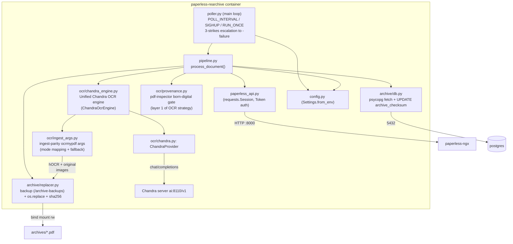
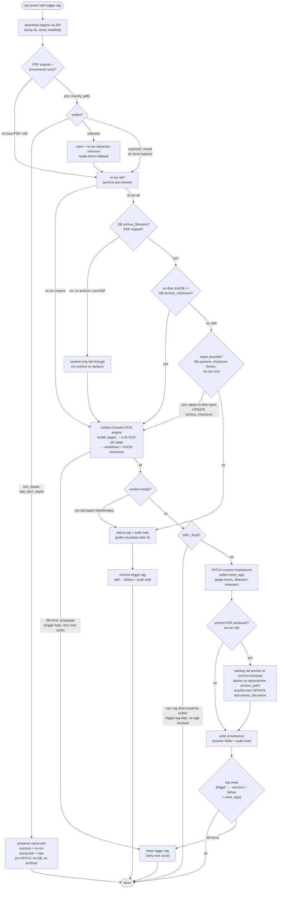

# paperless-rearchive — Planning

Working plan for the tag-driven re-OCR sidecar. This document is the source of truth for coding
agents; keep it up to date as phases complete. Status markers: ⬜ todo, 🔧 in progress, ✅ done.

## 1. Goal

Re-process the OCR of thousands of existing paperless-ngx documents using LLM vision OCR
(Chandra via the paperless-chandra ocrmypdf plugin), driven by tags:

- `re-ocr-content` — re-OCR, replace the document `content` field with the OCR output (markdown).
- `re-ocr-all` — as above, plus regenerate the archive version of the document and update the
  database checksum.

- `re-ocr-page-errors` — added alongside `-success` or `-failure` when a document has partial OCR
  results (some pages succeeded, some failed). This tag signals that the document has OCR content
  but with gaps that may need manual review or re-processing.
The original file is immutable; it is only downloaded via the API and used as OCR source.

## 2. Research notes (confirmed against paperless-ngx source / docs)

- **Unified OCR architecture** (Phase 3b ✅ done): a single Chandra pass produces both
  markdown content and hOCR structures (`paperless_rearchive/ocr/chandra_engine.py`,
  `ChandraOcrEngine`). For `re-ocr-content`, only the markdown is used (no PDF/A generated).
  For `re-ocr-all`, the hOCR is passed to ocrmypdf's sandwich pipeline to produce the
  searchable PDF/A from the original scan images. This avoids wasting CPU on PDF/A
  generation for content-only mode. The branching decision is made after OCR completion
  based on the trigger tag. PDF/A assembly always uses ocrmypdf's sandwich pipeline for
  maximum compatibility and PDF/A compliance.
- **Archive checksum**: `documents.utils.compute_checksum` — **SHA-256** of the file bytes (verified live: the
  on-disk file's SHA-256 matches the DB value exactly; earlier paperless releases used MD5)
  when the archive is moved into `settings.ARCHIVE_DIR`. Correct update statement:
  `UPDATE documents_document SET archive_checksum = '<sha256>' WHERE id = <id>;`
- **Archive directory**: `media/documents/archive/` (singular) on this deployment, with
  template-derived subdirectories (e.g. `Retirement/Steffen Richter/2026/…pdf`);
  246 of 5352 documents have no archive file.
- **Orphaned-file health check vs. backups**: paperless-ngx's sanity checker walks
  `PAPERLESS_MEDIA_ROOT` and flags every file it cannot account for, so the sidecar's
  `.bak-<timestamp>` copies sitting in `media/documents/archive/` surface as
  `Orphaned file in media dir: …/documents/archive/….pdf.bak-…` warnings. Hence
  backups go to the fixed `/archive-backups` mount outside the media dir (typically a separate bind
  mount, possibly another disk - they are *copied*, so cross-device is fine), and startup
  refuses to run when the setting resolves into the archive tree.
- **Archive filename / path**: *not* always `<id>.pdf`. `file_handling.generate_unique_filename(
  doc, archive_filename=True)` derives it from storage-path / `PAPERLESS_FILENAME_FORMAT`
  templates (or `<pk:07>.pdf` when no template). The API's `archived_file_name` is only a
  **flattened display name** (e.g. `2026-01-07 Immigration US re-archive-test.pdf`) and does
  **not** give the on-disk location. The real relative path lives only in the DB column
  `documents_document.archive_filename` (e.g.
  `Passports_Visas_IDs/DE/2026/2026-01-07_re-archive-test.pdf`); the sidecar resolves it via
  `archive/db.py: fetch_archive_filename` and never reconstructs it from the document id.
- **Born-digital PDFs**: in `auto` mode paperless skips OCR for PDFs with an existing text layer
  (`skip_text`, `pdf_born_digital_text`); `PAPERLESS_ARCHIVE_FILE_GENERATION`
  (`never`/`only`/`always`) decides whether an archive file is produced at all. Documents
  without an archive file ⇒ content-only mode in this sidecar.
- **Non-PDF originals** (jpg/png/tiff/…): content-only by design — no archive file
  exists to regenerate, and `REARCHIVE_ARCHIVE_FOR_IMAGES` is a reserved knob parsed in
  `Settings.from_env()` but never consulted by `pipeline.py` (see §7). Non-PDF `re-ocr-all`
  requests fall through to content-only mode.
- **API limits**: there is no endpoint to upload/replace the archive version of an existing
  document, and the document upload endpoint only creates *new* documents — hence the
  bind-mount + direct DB update approach used here.
- **Downloading the *original***: `/api/documents/{id}/download/` returns the **archive** version
  by default. The immutable original requires the query parameter `?original=true` (verified
  live — without it the sidecar re-OCR'd an archive it had itself just written). The sidecar
  always passes `original=true` and works in a scratch directory; nothing writes to
  `media/documents/originals/`.
- **Tag lookup**: `/api/tags/` silently ignores `?name=` and `?name__exact=`; `?name__iexact=`
  works. `?name__icontains=` is a trap — `re-ocr-all` also matches `re-ocr-all-success`. The
  sidecar uses `name__iexact` (regression-tested in `tests/test_paperless_api.py`).
- **Content update**: `PATCH /api/documents/{id}/ {"content": "..."}` works — `content` is
  writable in the documents serializer.
- **Live probe (2026-09-15, instance with 5352 docs)**: the serializer does **not** expose
  `archive_checksum`, so it is read directly from Postgres
  (`archive/db.py: fetch_archive_checksum`); 246 of 5352 documents have no archive file.
- **OCR mode vs. text layer**: `redo_ocr` replaces the invisible text layer in place and leaves
  the page images alone, so the archive keeps its size; `force_ocr` rasterises every page and
  inflates the file (measured 616 KiB → 4.6 MiB on one scan). `ocrmypdf` **rejects**
  `--redo-ocr` combined with `--deskew`/`--clean-final`/`--remove-background`, so the runner
  must drop deskew rather than fall through to `force_ocr` (a silent fallback here would have
  inflated every archive).
- **`skip_text` sidecar hazard (legacy `ocr/runner.py` path)**: with `skip_text`, ocrmypdf's
  sidecar contains only `[OCR skipped on page(s) …]`. The legacy runner treated an
  all-placeholder sidecar as a hard failure (`ocr_skipped_all`) instead of a result so it
  could never be written to `content`. `ocr/runner.py` is superseded by
  `ocr/ingest_args.py` + `ocr/chandra_engine.py` and kept only for the integration harness
  (`diag_original.py`, `check_download.py`, `size_compare.py`); it is not wired into the
  pipeline.
- **Chandra repeat-token retries (handled)**: when the vLLM/Chandra server logs
  `Detected repeat token, retrying generation (attempt N)`, the model is looping on a
  bad/empty page. `ChandraOcrEngine` relies on the upstream temperature retry ladder
  (`chandra.settings.MAX_VLLM_RETRIES`, base temperature 0.0 / top_p 0.1, retries at
  `min(base+0.2*N, 0.8)` / top_p 0.95) plus a post-hoc `detect_repeat_token` check —
  recovered pages are kept, unrecoverable pages land in `error_pages` and surface via the
  `re-ocr-page-errors` tag (see Risks for the measured case).
- **Re-OCR wall-time breakdown (measured 2026-09-17, doc 4221, 8 pages)**: `re-ocr-content`
  finished in 98.4 s (8 Chandra POSTs, zero repeat-token retries) while `re-ocr-all` took 307.8 s.
  Phase timing from the logs: setup ~2 s; per-page rasterize + Tesseract OSD + **inference**
  03:14:21→03:19:26 ≈ 304 s for **11 generations** (8 pages + 3 repeat-token retry generations);
  graft (HocrParser) + Ghostscript PDF/A + image optimize ≈ **1.3 s** — *not* the ~190 s an
  earlier analysis guessed (that "assembly" time was itself repeat-token retries, as was the
  P1-era 191 s assembly). Inference is therefore comparable between the paths *when no page
  loops*; the entire delta in this run was ~200 s of repeat-token retry inference on 2 of 8
  pages. Root cause of the divergence: the two paths feed **different rasterized images** to the
  same deterministic decode (temperature 0.0 / top_p 0.1) — the content path renders with
  PyMuPDF @300 dpi RGB, the archive path rasterizes via ocrmypdf/Ghostscript at the page's
  effective DPI — and borderline pages flip into/out of repetition loops depending on the pixels.
- **Model provenance baked into the archive (2026-09-17)**: ocrmypdf's `Creator` metadata records
  engine/library versions only (`ChandraEngine.creator_tag` → `Chandra <chandra-ocr version>` via
  `importlib.metadata.version("chandra-ocr")`), so the served model name is appended after the
  pass: `pdf.docinfo['/Creator'] += ' [model: <PAPERLESS_CHANDRA_MODEL_NAME>]'` with XMP
  `xmp:CreatorTool` kept in sync via pikepdf (`_stamp_model_provenance`). Gotcha found while
  implementing: pikepdf's context manager does **not** auto-save with
  `allow_overwriting_input=True` — an explicit `pdf.save()` is required or the metadata changes
  are silently discarded on close.
- **Base image**: paperless-ngx now ships `python:3.14-slim` (Debian 13 *trixie*) and this
  sidecar uses the same base. `jbig2` (bilevel compression for ocrmypdf) is available as an apt
  package in trixie and is installed directly; together with `pngquant` it saved ~15-19% on a
  real re-OCR run.

## 3. Architecture



### Unified OCR engine architecture

The `ChandraOcrEngine` class in `ocr/chandra_engine.py` provides a unified OCR pipeline:

```python
class ChandraOcrEngine:
    def ocr_document(self, pdf_path, *, produce_pdf=False, output_pdf_path=None,
                     settings=None, provenance=None, force=False):
        # 1. Render PDF pages to images (PyMuPDF, REARCHIVE_OCR_DPI)
        # 2. For each page: call Chandra → markdown + hOCR
        #    (content path OCRs only provenance.pages_needing_ocr;
        #     native pages keep pdf-inspector markdown)
        # 3. Combine page markdown in page order
        # 4. IF produce_pdf: assemble PDF/A via ingest-parity ocrmypdf
        #    sandwich (mode from _resolve_ingest_mode)
        # RETURN: OcrResult(markdown, pdf_path, page_count, error_pages, errors)
```

**Branching logic:**
- `re-ocr-content`: `produce_pdf=False` → markdown only, no PDF/A assembly
- `re-ocr-all`: `produce_pdf=True` → markdown + hOCR → ocrmypdf sandwich → PDF/A

**Page-level error handling:**
- OCR errors on individual pages are collected in `result.error_pages` and `result.errors`
  (Chandra errors, empty results, `REARCHIVE_MAX_PAGES` skips)
- If some pages succeed and some fail, `re-ocr-page-errors` is added alongside the outcome
  tag; error page numbers are recorded in the audit note/provenance
- Error information includes page numbers and error messages for debugging

### Per-document flow



Key points the chart encodes (matching `pipeline.py`):
- **Provenance gate runs before anything else** (`classify_pdf` on PDF originals only;
  `re-ocr-force` bypasses it; `unknown` warns and falls back to mode-driven behaviour).
- **Archive pre-checks can demote `re-ocr-all` to content-only** (no `archive_filename` in
  the DB, or a non-PDF original) — never an error.
- **Checksum drift is repaired, not fatal**: on-disk bytes are adopted via
  `_repair_checksum_drift()`; only unrepairable drift fails the document.
- **`extra_tags` are collected right after PATCH** and applied at the final tag swap, which
  is also where a tag-API hiccup keeps the trigger (`TAGSWAP -- API error --> KEEP`).
- **Failure escalation lives in the poller** (3 consecutive failures per doc+trigger), not
  in `process_document`; DB errors propagate so the trigger is kept and retried.

## 4. Repository layout

```
paperless-rearchive/
├── README.md                  # living overview + status
├── CHANGELOG.md               # Keep-a-Changelog style release notes
├── doc/
│   ├── PLANNING.md            # this file
│   ├── RELEASING.md           # release runbook (versioning rhythm, CI, rollback)
│   └── deploy/
│       ├── compose-snippet.yml
│       └── env.example
├── scripts/release-check.sh   # release guard (versions, changelog, tests)
├── paperless_rearchive/
│   ├── __init__.py            # __version__ from installed package metadata
│   ├── config.py              # env-driven Settings
│   ├── logging_setup.py       # shared logging config (poll + containers)
│   ├── secrets.py             # *_FILE secret resolution (paperless-ngx convention)
│   ├── paperless_api.py       # REST client (tag lookup, original download, PATCH, tag swap)
│   ├── pipeline.py            # per-document orchestration
│   ├── poller.py              # main loop (entry point)
│   ├── restore.py             # restore_backup CLI (archive/content restore from .bak)
│   ├── ocr/
│   │   ├── __init__.py
│   │   ├── base.py            # OcrProviderPlugin ABC + registry
│   │   ├── chandra.py         # Chandra provider
│   │   ├── chandra_engine.py  # unified engine: per-page Chandra + ingest-parity ocrmypdf pass
│   │   ├── ingest_args.py     # ingest-parity ocrmypdf argument builder + text semantics
│   │   ├── provenance.py      # pdf-inspector born-digital gate (layer 1 of OCR strategy)
│   │   └── runner.py          # legacy builder, integration-harness only (not in pipeline)
│   └── archive/
│       ├── __init__.py
│       ├── db.py              # psycopg checksum/archive reads + UPDATE
│       └── replacer.py        # backup + atomic replace + sha256
├── docker/Dockerfile          # CHANDRA_REF build-arg pins paperless-chandra
├── pyproject.toml
└── tests/
    ├── test_*.py              # pytest unit tests (157 passing)
    └── integration/           # live-stack harness (see its README)
```

## 5. Phases

### Phase 1 — Documentation & scaffold ✅
- ✅ README.md, PLANNING.md, diagrams
- ✅ package scaffold, pyproject, Dockerfile, compose snippet

### Phase 2 — Core plumbing ✅
- ✅ `config.py` Settings
- ✅ `paperless_api.py` (ensure_tag, doc_ids_with_tag, download, patch content, tag swap)
- ✅ `ocr/base.py` ABC + provider registry (validated live against local paperless-chandra)

### Phase 3 — OCR pipeline ✅
- ✅ `ocr/chandra.py` provider (wraps paperless-chandra ocrmypdf plugin)
- ✅ `ocr/ingest_args.py` (ingest-parity mode selection `auto`/`redo`/`skip`/`force`/`off`,
  `pdfa`, deskew/clean with the redo-incompatibility guard, image DPI/alpha handling,
  fallback retry) — supersedes `ocr/runner.py`, which is retained for the integration
  harness only and is not wired into the pipeline
- ✅ `pipeline.py` orchestration incl. dry-run + tag lifecycle

### Phase 3b — Unified OCR engine ✅

- ✅ `ocr/chandra_engine.py`: unified `ChandraOcrEngine` — renders PDF pages (PyMuPDF),
  calls Chandra once per page, produces both markdown and hOCR structures
- ✅ Branch after OCR: `re-ocr-content` uses markdown only; `re-ocr-all` uses hOCR + ocrmypdf
  sandwich pipeline for PDF/A assembly
- ✅ Page-level error tracking: collect per-page failures (Chandra errors, empty results,
  `REARCHIVE_MAX_PAGES` skips), add `re-ocr-page-errors` tag when some pages succeed and
  some fail
- ✅ `pipeline.py` uses the unified engine and branches on archive_mode
- ✅ `PyMuPDF` (fitz) dependency for PDF page rendering
- ✅ README.md reflects the unified architecture

### Phase 4 — Archive replacement ✅
- ✅ `archive/db.py` (psycopg; fetch + update archive_checksum)
- ✅ `archive/replacer.py` (verify checksum + checksum-drift repair, backup below the
  fixed `/archive-backups` mount outside the archive tree, atomic replace, sha256 — the legacy
  next-to-archive fallback was removed)
- ✅ DB password from secret file `paperless_db_paperless_passwd`
- ✅ `restore.py` (`restore_backup` CLI): restore archive and/or `content` from
  `.bak-<timestamp>` backups, with audit note + provenance/tag cleanup

### Phase 5 — Deployment & tests ✅
- ✅ Dockerfile (python:3.14-slim/trixie + ghostscript/tesseract/qpdf/pngquant/jbig2/poppler +
  ocrmypdf + paperless-chandra from git `CHANDRA_REF` (default `master`); image builds and all
  deps import on 3.14)
- ✅ compose snippet + `.env.example`
- ✅ unit tests (157 passing: replacer, ingest/runner args/mode selection, provenance,
  chandra engine, API tag lookup, custom fields/notes, pipeline, poller, restore, config +
  backup-directory validation)
- ✅ live smoke test (2026-09-15): dry-run cycle against the running instance
  (`http://localhost:8001`) — document 5488 tagged `re-ocr-content` + `re-ocr-all` was OCR'd
  end-to-end via the live Chandra server (~30k chars markdown sidecar produced, nothing
  written, trigger tag kept). Dry-run never touches tags — enforced in `pipeline`.
- ✅ in-container e2e of the OCR stage (`tests/size_compare.py`, run on the `backend` network
  with real DB + API access): DB path resolution via `fetch_archive_filename`, checksum
  verification, full ocrmypdf+Chandra run.
- ✅ `REARCHIVE_OCR_MODE=auto` added: redo_ocr (text layer present) vs force_ocr.
- ✅ **full e2e incl. writes (2026-09-16, doc 5820, both trigger paths)**:
  - `re-ocr-all`: poller run → archive replaced (624 KiB, PDF/A-2b, sha256 `d9203b60…`) →
    `archive_checksum` UPDATE verified against `sha256sum` on disk → tag swapped to
    `re-ocr-all-success` → **original byte-identical** (`31feb5e0…`, mtime unchanged).
  - `re-ocr-content`: content PATCHed to freshly OCR'd markdown → archive file **untouched**
    (byte-identical) → tag swapped to `re-ocr-content-success`.
  - harness: `tests/integration/{run_poller_e2e,run_content_e2e,verify_state,reset_baseline}.sh`
    (env-driven, run against the live stack).
- ✅ API correctness fixes found by e2e: `?original=true` on the download endpoint,
  `?name__iexact=` for tag lookup.
- ✅ archive size root cause identified and fixed: the silent `redo_ocr` → `force_ocr` fallback
  triggered by the (unsupported) `redo_ocr` + `deskew` combination. See Research notes / Risks.
- ✅ repeat-token handling: the upstream temperature retry ladder (`MAX_VLLM_RETRIES`) recovers
  looped pages (measured 2026-09-17, doc 4221: 8/8 ok after 3 extra generations); unrecoverable
  pages land in `error_pages` and surface via the `re-ocr-page-errors` tag. Per-run retry
  visibility (retried pages + generations in the audit note/provenance) and
  rasterization-parity investigation remain open — see §7.
- ⬜ bulk-run procedural safeguards: (a) confirm search index reflects PATCHed content on a
  real doc — PATCH a unique probe token (e.g. `REARCHIVE-PROBE-<ts>`) via the sidecar path,
  then `GET /api/search/?query=<token>` must hit and a removed distinctive token must not;
  repeat for a `re-ocr-all` doc and a tags-only PATCH (mechanism already verified upstream —
  `DocumentViewSet.update()` reindexes synchronously via `get_backend().add_or_update()`;
  see §7); (b) rehearse a small `re-ocr-all` batch before mass re-OCR.

## 6. Configuration

Environment variables (prefix `REARCHIVE_` where generic; `PAPERLESS_CHANDRA_*` shared with the
paperless container for provider settings).

**Secret convention:** every credential supports the paperless-ngx `_FILE` mechanism — for a
variable `NAME`, the environment variable `NAME_FILE` may point at a file (e.g. a Docker secret)
whose content is used instead of `NAME`. `_FILE` wins when both are set. This applies to the API
token, the Chandra key, and the database user/password.

| Variable | Default | Description |
| --- | --- | --- |
| `PAPERLESS_BASE_URL` | `http://paperless:8000` | paperless-ngx base URL |
| `PAPERLESS_API_TOKEN` *(or `PAPERLESS_API_TOKEN_FILE`)* | *(required)* | API token (from `.env.paperless-gpt`) |
| `REARCHIVE_TRIGGER_TAG_CONTENT` | `re-ocr-content` | trigger tag, content-only mode |
| `REARCHIVE_TRIGGER_TAG_ALL` | `re-ocr-all` | trigger tag, archive + content mode |
| `REARCHIVE_SUCCESS_SUFFIX` | `-success` | success tag suffix |
| `REARCHIVE_FAILURE_SUFFIX` | `-failure` | failure tag suffix |
| `REARCHIVE_ARCHIVE_DIR` | `/archive` | in-container mount of `media/documents/archive` (override only if the mount differs) |
| `REARCHIVE_BACKUP_DIRECTORY` | n/a (fixed `/archive-backups`) | hardwired backup mount for `.bak-<timestamp>` files. Outside the archive tree — separate bind mount, possibly another disk (backups are *copied*). Created/verified at startup; startup **refuses to run** when the mounts overlap (symlinks included), or when it is not writable. |
| `REARCHIVE_PROVIDER` | `chandra` | OCR provider plugin |
| `PAPERLESS_CHANDRA_SERVER_URL` | *(required)* | e.g. `http://ai:8110/v1` |
| `PAPERLESS_CHANDRA_MODEL_NAME` | `chandra` | e.g. `chandra-ocr-2-q8` |
| `PAPERLESS_CHANDRA_API_KEY` *(or `PAPERLESS_CHANDRA_API_KEY_FILE`)* | *(optional)* | Chandra server API key / secret file |
| `PAPERLESS_CHANDRA_CONTENT_FORMAT` | `markdown` | `markdown` or `text` |
| `PAPERLESS_CHANDRA_MAX_OUTPUT_TOKENS` | `12384` | per-page token budget |
| `REARCHIVE_OCR_LANGUAGE` | `eng` | passed through to ocrmypdf (labels hOCR) |
| `REARCHIVE_OCR_MODE` | `redo` | Layer 2 of the OCR strategy (§8.4): how an existing text layer on OCR candidates is treated. `redo`: strip + re-OCR (page images untouched); `skip`: `--skip-text` (OCR textless pages only, native text kept); `auto`: ocrmypdf default (like ingest); `force`: always rasterise + re-OCR (much larger archive, bypasses the provenance gate); `off`: PDF/A conversion only, no OCR (bypasses the gate) |
| `REARCHIVE_OCR_CLEAN` | `clean` | image cleaning before OCR (`final` maps to `clean` under `redo`, as at ingest); `none` disables |
| `REARCHIVE_OCR_DESKEW` | `true` | deskew pages before OCR (ocrmypdf forbids deskew with `redo`; dropped automatically, as paperless does) |
| `REARCHIVE_OCR_ROTATE_PAGES` | `true` | 90/180/270 orientation fix before OCR (via the Chandra engine's OSD) |
| `REARCHIVE_OCR_ROTATE_PAGES_THRESHOLD` | `12.0` | confidence threshold for `rotate_pages` |
| `REARCHIVE_OCR_DPI` | `300` | render DPI for the **content-only** fast path (PyMuPDF render before the Chandra call). `re-ocr-all` runs rasterise inside ocrmypdf, so this does not affect archive production |
| `REARCHIVE_OCR_OUTPUT_TYPE` | `pdfa` | archive PDF/A flavour |
| `REARCHIVE_OCR_USER_ARGS` | *(unset)* | extra ocrmypdf kwargs (JSON), e.g. paperless `PAPERLESS_OCR_USER_ARGS` |
| `REARCHIVE_ARCHIVE_FOR_IMAGES` | `false` | Reserved: parsed but not consulted by `pipeline.py` — non-PDF originals are always content-only today (see §7). |
| `REARCHIVE_POLL_INTERVAL` | `300` | seconds between polls **when idle**. Adaptive draining: while a backlog exists (or a cycle made progress), cycles run ~10 s apart (fixed `_ACTIVE_POLL_INTERVAL_S`); no-progress cycles back off exponentially to the idle interval. Each cycle logs docs/min + backlog ETA and recommends batch/poll values |
| `REARCHIVE_BATCH_LIMIT` | `5` | max documents per cycle |
| `REARCHIVE_WRITE_PROVENANCE` | `true` | write OCR run provenance to custom fields (`OCR engine`, `OCR date`, `OCR pages`, `OCR archive ratio` for re-ocr-all) and append an audit note per run (`POST /api/documents/{id}/notes/`, also on failure); definitions auto-created once via API, skipped in dry-run |
| `REARCHIVE_OCR_CONCURRENCY` | `1` | pages OCR'd concurrently per document (ThreadPoolExecutor around the blocking Chandra call). Default 1 = sequential. WARNING: local vision LLM = GPU bottleneck; >1 only piles competing requests onto the same GPU (higher per-page latency, timeout/OOM risk). Raise gradually, watch GPU. |
| `REARCHIVE_MAX_PAGES` | `0` | max pages OCR'd per document; 0 = all pages, otherwise only the first N pages are processed (page_count still reports the total; skipped pages recorded in error_pages) |
| `REARCHIVE_PDF_PROVENANCE` | `auto` | per-page born-digital detection (pdf-inspector): `auto` classifies each PDF original and routes pages to OCR; `off` keeps the legacy mode-driven behaviour. See §8 |
| `REARCHIVE_SKIP_BORN_DIGITAL` | `true` | `true`: a born-digital original is left untouched (no content PATCH, no ocrmypdf pass, no DB access); `false`: detect + annotate only, still OCR |
| `REARCHIVE_PRESERVED_TAG` | `re-ocr-preserved` | tag added alongside `-success` when native text was preserved; set empty to disable |
| `REARCHIVE_OCR_MIXED_MODE` | `skip` | ocrmypdf mode for mixed-provenance archive runs (`skip`/`redo`/`force`); `skip` = `--skip-text`, the only mode that keeps native pages intact while OCR'ing textless ones |
| `REARCHIVE_PROVENANCE_MAX_PAGES` | `0` | pages inspected by the provenance classifier; 0 = all |
| `REARCHIVE_FORCE_TAG` | `re-ocr-force` | modifier tag (never auto-created) placed alongside a trigger to bypass the provenance gate and force OCR of every page; set empty to disable |
| `REARCHIVE_DRY_RUN` | `false` | OCR + report only, no writes |
| `REARCHIVE_RUN_ONCE` | `false` | single cycle then exit |
| `REARCHIVE_LOG_LEVEL` | `INFO` | log level |
| `PAPERLESS_DBHOST` / `PAPERLESS_DBPORT` / `PAPERLESS_DBNAME` | `postgres` / `5432` / `paperless` | DB connection |
| `PAPERLESS_DBUSER` *(or `PAPERLESS_DBUSER_FILE`)* | `paperless` | DB user |
| `PAPERLESS_DBPASS` *(or `PAPERLESS_DBPASS_FILE`)* | *(required for re-ocr-all)* | DB password / secret file |

Secrets (already defined in `paperless-lxc/docker-compose.yml`): `chandra_api_key`,
`paperless_db_paperless_passwd`.

## 7. Risks / open questions

- ✅ **Resolved** — poller lost-wakeup: a SIGHUP arriving while a cycle ran was cleared after the
  cycle and the poller slept the full interval (observed 2026-09-17). `_sleep_or_immediate()` now
  consumes the signal and starts the next cycle immediately (regression-tested).
- ✅ **Resolved** — ocrmypdf `--clean` (re-introduced by ingest parity) requires `unpaper`; it is
  now installed in the image (`docker/Dockerfile`).
- ✅ **Resolved** — `archived_file_name` is *not* a path; the on-disk archive path is read from
  the DB column `documents_document.archive_filename` (see Research notes).
- ✅ **Resolved (mechanism verified 2026-09-19, live round-trip still open)** — search index
  on content PATCH. `DocumentViewSet.update()` (`src/documents/views.py`) calls
  `get_backend().add_or_update(refreshed_doc)` synchronously in the request after
  `perform_update()`, then sends `document_updated` (workflows/websockets/LLM-vector index;
  the main Tantivy index update is the explicit `add_or_update()` call, not the signal).
  What is indexed is the effective content, so versioned documents are covered. Lock
  contention is retried/deferred via `batch_update()` / celery `index_document`, not lost.
  Remaining work is the live verification procedure, tracked under Phase 5 bulk-run
  safeguards below — not a code task.
- ✅ **Accepted (2026-09-19) — thumbnails are consume-time artifacts, never refreshed on
  PATCH.** Stored at `THUMBNAIL_DIR/<pk:07>.webp` (`Document.thumbnail_path`), written only
  during consume (`consumer.py`: `parser.get_thumbnail()` → `_write(thumbnail, …)`) and the
  internal re-parse task; `DocumentViewSet.update()` does not touch them and a missing thumb
  is `Http404` (no lazy regeneration). For `redo`/`skip` the archive pixels are unchanged, so
  the existing thumbnail stays pixel-accurate — no action. After `force` (re-rasterised
  pixels) the stored preview shows the old rendering indefinitely: a known, `force`-only
  limitation. Not worth a sidecar renderer (new `THUMBNAIL_DIR` bind-mount, format/sizing
  parity, etag behavior); revisit only on a user complaint, e.g. as an opt-in thumbnail
  refresh gated to `force` runs.
- ⬜ Concurrency with paperless workers: the checksum-verify-before-replace step (plus
  checksum-drift repair of interrupted runs) is the only guard against concurrent
  modification — acceptable for a single-operator instance.
- ✅ **Resolved** — `invalidate_digital_signatures: true` (paperless `PAPERLESS_OCR_USER_ARGS`)
  is mirrored via `REARCHIVE_OCR_USER_ARGS` in the sidecar runs.
- ✅ **Resolved** — archive size regression: the cause was a *silent fallback*, not
  `redo_ocr` itself. `ocrmypdf` rejects `--redo-ocr` together with `--deskew`; the runner's
  generic error-fallback then retried with `force_ocr`, which rasterises every page
  (measured 616 KiB → 4.6 MiB on a 72 dpi scan; doc 3723 112 KiB → 900 KiB). The runner now
  drops deskew when it selects `redo_ocr` (mirrors paperless-chandra `parser.py:395`) and logs
  a warning instead of silently inflating archives. `auto` never rasterises.
- ⬜ **Repeat-token retry visibility + rasterization parity**: the retry ladder already
  recovers looped pages (see Research notes for the doc 4221 measurement: 8/8 ok at a cost
  of ~200 s wall time for 3 extra generations). Open follow-ups: (a) log a per-run retry
  summary (retried pages + generations) into the audit note/provenance for visibility;
  (b) investigate rasterization parity between the two paths (PyMuPDF @300 dpi RGB vs
  ocrmypdf/Ghostscript at effective DPI) to reduce loop divergence; (c) `MAX_VLLM_RETRIES`
  tuning trades wall time vs success rate.
- ✅ **Resolved** — inconsistent failure semantics: DB errors were retried at some call sites
  (`fetch_archive_filename`, post-OCR fetch) but permanently failed the document at others
  (pre-OCR checksum fetch); and a Chandra server outage failed `re-ocr-content` documents
  (per-page catch) while `re-ocr-all` documents self-healed (document abort). DB errors now
  always propagate (trigger kept -> retried), and `ChandraClientError` aborts content runs
  exactly like archive runs. Permanently broken documents are handled by escalation: 3
  consecutive failures per (doc, trigger) swap the trigger for `<trigger>-failure` + audit note.
- ✅ **Resolved** — idle poll interval wasted half the time on large backlogs (fixed 300 s sleep
  between cycles). Polling is now adaptive: ~10 s between cycles while draining, exponential
  backoff on no-progress cycles, idle interval when the queue is empty.
- ✅ **Decision (2026-09-18) — PostgreSQL-only, no DB abstraction layer.** `archive/db.py`
  uses `psycopg`; paperless-ngx itself supports `sqlite` / `postgresql` / `mariadb` via
  `PAPERLESS_DBENGINE`, but this sidecar stays Postgres-only. Rationale and analysis are
  recorded in §9 (Django cache safety, DB-agnostic cost, deployment split, SQLite locking).
  On a SQLite/MariaDB paperless, `re-ocr-content` works but `re-ocr-all` cannot. README
  documents this. Revisit only if a non-Postgres user with a real large library asks.
- ⬜ **`REARCHIVE_ARCHIVE_FOR_IMAGES` is parsed but not implemented**: `Settings.from_env()` reads
  it, but `pipeline.py` never consults it — non-PDF originals (JPEG/TIFF/PNG scans) are *always*
  routed to content-only mode (see Research notes), so images can never get an archive version
  regenerated. Either implement it (feed images through the ingest-style ocrmypdf path with
  img2pdf + image_dpi handling, like `paperless_chandra.parser` does) or remove the knob and
  document content-only as the design. Discovered 2026-09-17 while writing the README
  configuration reference; README now marks it Reserved.
- ⬜ paperless-chandra is installed from git `CHANDRA_REF` (default `master`; no release tags
  published upstream yet). `docker/Dockerfile` accepts the ref as a build-arg for reproducible
  release builds — pin a tag there (and record it here) once available.
- ⬜ `REARCHIVE_OCR_MODE=force` should only be used knowingly: it is the only mode that changes
  archive size dramatically, and it bypasses the provenance gate.
- ✅ **Resolved** — `.bak` files inside `media/documents/archive/` tripped paperless-ngx's
  orphaned-file health check. `/archive-backups` relocates the backups outside the
  media dir (cross-disk safe: they are copied), mirrors the archive's sub-directory layout, is
  created/verified at startup, and is refused at/below the archive directory. It is now a
  **mandatory** setting — the legacy next-to-archive fallback was removed entirely, backups are
  unconditional (no skip option), and the replacer has a runtime backstop that refuses any backup
  destination resolving inside the archive directory.

- ✅ **Resolved** — born-digital PDFs were mangled by `re-ocr-all` under the default
  `REARCHIVE_OCR_MODE=redo` (incident 2026-09-18, doc 3452). See §8: a pdf-inspector
  provenance gate now keeps native text and skips the document entirely.
- ⬜ **Mixed-provenance archive divergence**: ocrmypdf applies one mode per file, so a mixed
  document is archived with `--skip-text`; a "scanned" page that already carries an *untrusted*
  OCR layer is therefore left as-is (pdf-inspector can flag it while ocrmypdf considers it
  text-bearing). Mitigations: `re-ocr-force` modifier, or future split/redo/merge. See §8.9.
- ⬜ **pdf-inspector dependency**: a ~15 MB `cp38-abi3-manylinux_2_17_x86_64` wheel (no build
  toolchain, installs on `python:3.14-slim`); `classify_pdf` never raises — on missing
  pdf-inspector or detection error it falls back to the document-level heuristics and then to
  `unknown` (mode-driven behaviour + `re-ocr-detection-unknown` tag). The fallback cannot see
  per-page detail.

### Phase 6 — Release engineering ✅

- ✅ `CHANGELOG.md` (Keep a Changelog) seeded with the 0.1.0 release notes.
- ✅ Version single-sourced: `__version__` reads `importlib.metadata` (pyproject remains the
  source of truth); regression-tested; poller startup log shows the version.
- ✅ `doc/RELEASING.md` runbook (versioning rhythm, runbook, hotfix/rollback) and
  `scripts/release-check.sh` guard (clean tree, tag free, version/changelog agreement, tests).
- ✅ Release decision (2026-09-17): **no CI, no registry, no prebuilt images** — releases are
  source tags built locally with docker compose (seconds, cached layers). Gitea Actions workflows
  were prototyped and dropped: for a single-operator project the local `release-check.sh` guard
  provides the same quality gate, and the runner/registry stack (act_runner, job image, registry
  secrets) added infrastructure with no offsetting benefit. A BuildKit pip hang discovered during
  the CI job-image build (worked around via a commit-a-container build) sealed the decision; the
  parked runner setup remains at `/home/paperless/act-runner/` (not registered, not running).
- ✅ `docker/Dockerfile`: `CHANDRA_REF` build-arg pins the paperless-chandra ref (closes the
  reproducibility risk above for release artifacts — pass a tag/SHA at release-build time).

## 8. Born-digital provenance gate (pdf-inspector)

### 8.1 Incident 2026-09-18: `re-ocr-all` mangled a born-digital PDF

Document 3452 (Agoda Bali voucher, `wkhtmltopdf 0.12.6`) is a born-digital PDF with a
perfectly good native text layer. It was re-archived with `re-ocr-all`; the archive's
`Creator` changed from `wkhtmltopdf 0.12.6` to `OCRmyPDF 17.7.1 / Chandra 0.2.0` and the
content field became a Chandra *description of the layout* ("Two empty rectangular boxes
stacked vertically…") instead of the text. Root cause: the only born-digital protection in
the pipeline (`resolve_mode` + `has_visible_text_content` + `pdf_born_digital_text`) is
consulted **only when `REARCHIVE_OCR_MODE=auto`**; the default `redo` strips and re-OCRs
every page unconditionally. Re-OCR is the tool's purpose, so the gate must be independent
of the mode.

### 8.2 pdf-inspector evaluation (measured live, 1.20.0, `cp38-abi3` wheel)

Probes run on this instance (doc originals/archives) and synthetic PDFs:

| input | `detect_pdf` (document-level, ~2 ms) | `extract_pages_markdown` per-page `needs_ocr` (~7–25 ms) |
| --- | --- | --- |
| 3452 original (born-digital) | `text_based` 1.00, none | p1 native ok; markdown `## Booking Confirmation…` |
| 3452 archive (after re-OCR) | `text_based` 1.00, none | p1 native ok |
| 4221 original (raw scan, 8 pp) | `scanned` 0.95, all 8 | all 8 `needs_ocr`, reason=`scanned` |
| 4221 archive (scan + invisible OCR layer) | **`text_based` 1.00, none — WRONG** | **all 8 `needs_ocr` — correct** |
| synthetic 1 text + 1 image page (mixed) | **`image_based` 0.80, needs [1,2] — WRONG** | p1 native ok, p2 `needs_ocr` — correct |
| synthetic image-only | `scanned` 0.95, all 1 | `needs_ocr`, reason=`scanned` |
| synthetic image + invisible text overlay | `image_based` 0.80 | `needs_ocr`, reason=`scanned` — correct |

Findings (these decide the design):

- **Use `extract_pages_markdown`, not `detect_pdf`/`classify_pdf`, as the authoritative
  signal.** The fast document-level classifier is fooled by an invisible OCR overlay
  (calls an OCR'd scan "text-based") and misclassifies mixed documents. The per-page
  `needs_ocr` correctly distinguishes native visible text from an OCR overlay in both cases.
- `extract_pages_markdown` also returns **native markdown per page** (empty when
  `needs_ocr` is true) — free, better-than-Chandra content for born-digital pages.
- Index conventions differ: `PageMarkdown.page` is **0-indexed**, `pages_needing_ocr` on
  `PagesExtractionResult` is **1-indexed** (as is `detect_pdf.pages_needing_ocr`;
  `classify_pdf.pages_needing_ocr` is 0-indexed). `ocr/provenance.py` normalises
  everything to 1-indexed page numbers internally.
- All `pdf_inspector` entry points take **`str`** paths; a `PosixPath` raises `TypeError`.
  Cost is ~2 ms (`detect_pdf`) / ~7–25 ms (`extract_pages_markdown`) per document, far
  below one Chandra page (tens of seconds) — no meaningful bulk-run cost.
- We do **not** use pdf-inspector's own OCR (`process_pdf_with_ocr`): Chandra stays the
  OCR engine; pdf-inspector is used only for provenance + native text extraction.

### 8.3 Decision: whole-document gate, per-page handling for mixed provenance

- **Whole document is the primary gate.** For all-native-text (born-digital) and
  all-scanned documents the aggregate verdict is unambiguous and cheap; this covers the
  overwhelming majority of the corpus.
- **Per page for mixed provenance.** When only some pages need OCR, native pages keep
  their own text (content: pdf-inspector native markdown; archive: ocrmypdf `skip_text`,
  which OCRs exactly the textless pages) and only the `needs_ocr` pages go to Chandra.
- Aggregate rule: `pages_needing_ocr == ∅` → `text_based`; `== all` → `scanned`;
  otherwise → `mixed`; detection error/unavailable → `unknown` (fall back to mode-driven
  behaviour, loud warning + `re-ocr-detection-unknown` tag, never crash).

### 8.4 Two-layer OCR strategy

Layer 1 (**provenance**, per page) answers *does this page have trustworthy native text?*
Layer 2 (**mode**, ocrmypdf) answers *for the pages routed to OCR, how is an existing text
layer treated?* `REARCHIVE_OCR_MODE` becomes the layer-2 knob applied to OCR candidates
only; it is no longer the top-level policy. Implemented as:

- Layer 1: `paperless_rearchive/ocr/provenance.py` — `PdfProvenance` dataclass +
  `classify_pdf(path, *, max_pages=0)`, wrapping `extract_pages_markdown(str(path))` and
  aggregating per §8.3. Never raises; falls back to the historical heuristics
  (`pdf_born_digital_text` + `has_visible_text_content`) and then to `unknown`.
- Layer 2: `paperless_rearchive/ocr/ingest_args.py` — `effective_mode(mode, kind,
  mixed_mode=...)` maps the configured mode + verdict onto an ocrmypdf mode, and the new
  explicit `skip` mode (→ `skip_text`). The old `auto`→`redo` "deviation" is retired for
  provenance-driven runs.

### 8.5 Pipeline policy (implemented)

| provenance | `re-ocr-content` | `re-ocr-all` |
| --- | --- | --- |
| `text_based` | **No Chandra, no PATCH** — content untouched; `-success` + `re-ocr-preserved` + audit note | **No re-OCR, no ocrmypdf pass, no DB access** — archive byte-identical; same tags |
| `scanned` | Chandra every page (as before) | ocrmypdf `redo`/`force` per mode; archive replaced |
| `mixed` | Chandra only `pages_needing_ocr`; native markdown for the rest; merged in page order | ocrmypdf **`skip_text`** (OCR only textless pages, native pages preserved); archive replaced; note records the split |
| `unknown` | mode-driven fallback + `re-ocr-detection-unknown` | same |

- `REARCHIVE_OCR_MODE=force`/`off` are explicit overrides and bypass the gate.
- The gate never fails a document; escalation to `-failure` after 3 attempts is unchanged.
- Unsure detection defaults to **skip** (non-destructive) and is tagged for review.

### 8.6 `re-ocr-force`: an explicit per-document override

A conservative gate will have false negatives (a scan the classifier reads as native, or a
mixed document whose scan pages carry an untrusted OCR layer that `skip_text` will not
touch). The modifier tag `REARCHIVE_FORCE_TAG` (default `re-ocr-force`) is placed
*alongside* a trigger; the poller resolves it once per cycle, marks the document forced,
and `_resolve_ingest_mode` returns `force` (rasterise + OCR everything). The modifier is
removed together with the trigger (`DocumentContext.removal_tag_ids()`). It is never
auto-created — the tag must already exist. This replaces reaching for the global
`REARCHIVE_OCR_MODE=force` (which would rasterise the entire backlog).

### 8.7 ocrmypdf mode-mapping fix (parity gap uncovered by this work)

`build_ocrmypdf_args(mode="auto")` sets **no** flag; ocrmypdf then *errors* if any page
already has text, and the generic `safe_fallback` retries with `force_ocr` — rasterising
and mangling the native pages of a mixed document. Upstream
`paperless_chandra.parser` passes `skip_text=True` for `AUTO` + text-present; our port
dropped that parameter. The new explicit `skip` mode closes the gap, and provenance-driven
runs never emit bare `auto` for a text-bearing PDF (mixed → `skip`).

### 8.8 Implementation (Phase 7) ✅

- ✅ `pyproject.toml`: `pdf-inspector>=1.20` as a core dependency (abi3 wheel; no build
  toolchain; installs on `python:3.14-slim`).
- ✅ `ocr/provenance.py`: `PdfProvenance` + `classify_pdf()` + heuristic fallback.
- ✅ `ocr/ingest_args.py`: `skip` mode (`skip_text`), `effective_mode()`.
- ✅ `ocr/chandra_engine.py`: `ocr_document(..., provenance=, force=)`;
  `_ocr_document_pages()` (content path OCRs only `pages_needing_ocr`, native pages keep
  pdf-inspector markdown); `_resolve_ingest_mode()` (archive path).
- ✅ `pipeline.py`: provenance gate after download (PDF originals only; non-PDF originals skip
  classification); `_preserve_born_digital()` (born-digital short-circuit before any
  DB/archive work); provenance added to the audit note; `_finish()` now actually adds
  `extra_tags` (latent bug fixed).
- ✅ `poller.py`: resolves the `re-ocr-force` modifier tag per cycle.
- ✅ `config.py`: the six new settings (validated).
- ✅ `tests/`: `test_provenance.py` (synthetic born-digital / scan / scan+invisible-overlay /
  mixed / capped / fallback / garbage); `test_ingest_args.py` (`skip`, `effective_mode`);
  `test_chandra_engine.py` (per-page content path, forced path, mode resolution);
  `test_pipeline.py` (preserved / forced / scanned gate); `test_config.py`.
- ✅ `tests/integration/inspect_pdf.py --decide`: prints the sidecar's gate decision.
- ✅ README "OCR strategy" rewritten as the two-layer model (provenance + mode), `re-ocr-force`
  modifier, new settings, updated guarantees/status.
- ✅ Dry-run on doc 3452 (2026-09-18): `provenance=text_based` → preserved, no writes; live
  `--decide` verified on 3452 (PRESERVE) and 4221 (OCR every page).

### 8.9 Risks / open questions

- ⬜ **Real mixed-provenance sample** still to be dry-run before mass use; the per-page rule
  is verified on synthetic cases and the two known documents only.
- ⬜ **Mixed-provenance archive divergence**: ocrmypdf applies one mode per file, so a mixed
  document is archived with `--skip-text`; a "scanned" page that already carries an *untrusted*
  OCR layer is therefore left as-is (pdf-inspector can flag it while ocrmypdf considers it
  text-bearing). Mitigations: `re-ocr-force` modifier, or future split/redo/merge. See §7.
- ⬜ **Native markdown fidelity**: for mixed content runs, native pages are re-serialised
  from pdf-inspector's markdown, which may differ from what paperless ingest stored.
- ⬜ **Pre-OCR'd scan originals** (uploaded already OCR'd) are detected as `scanned` by the
  per-page signal even though `detect_pdf` disagrees — regression-tested, but worth
  watching on real documents.
- ⬜ **Blank pages**: `_render_pdf_pages`/`_render_page_image` skip blank pages; the
  provenance path iterates real page numbers so OCR-page selection cannot shift.

## 9. Database research conclusions (2026-09-18)

Session research into the direct-DB `UPDATE documents_document SET archive_checksum` path.
Decision: **stay PostgreSQL-only** (`archive/db.py` + `psycopg`); no DB-agnostic layer.

### 9.1 Django cache is not a risk for the direct Postgres UPDATE

- `CACHES["default"]` is Redis (`PAPERLESS_REDIS`), but paperless-ngx uses it only for
  narrow key families in `src/documents/caching.py` — classifier suggestions
  (`doc_{id}_suggest` + classifier version/hash), LLM suggestions (`llm_*`), extracted
  PDF metadata (`doc_{id}_metadata` → `MetadataCacheData(original_checksum,
  original_metadata, archive_checksum, archive_metadata)`), thumbnail timestamps. There
  is **no ORM second-level / query cache** in front of `Document` rows or file responses.
- `get_metadata_cache()` re-reads `checksum`/`archive_checksum` from Postgres on every hit
  and drops the cached entry on mismatch (`cache.delete`), so a sidecar `UPDATE` can at
  worst cause one wasted metadata re-extraction, never a stale serve.
- `GET /api/documents/<id>/`, `download/?original=true`, and `serve_file(use_archive=…)`
  all do a fresh `Document.objects.get()`.
- Postgres `READ COMMITTED` makes the sidecar's `conn.commit()` in `archive/db.py`
  immediately visible to Django. `content`/tags/custom-fields/notes stay on REST `PATCH`
  so signals, search index, and audit log still fire; only `archive_checksum` (no API
  field) goes direct. Real risks are elsewhere: bypassed `post_save` for archive bytes
  (harmless — thumbnails derive from the original, `content` is PATCHed separately) and
  concurrent writers (covered by `verify_current_checksum()` + `_repair_checksum_drift()`).
  No `FLUSHDB` / `clear_document_caches()` needed from the sidecar.

### 9.2 A DB-agnostic layer would be cheap SQL, expensive everything else

- Query surface is two shapes (`SELECT <allowlisted col> ... WHERE id = %s`, `UPDATE ...
  SET archive_checksum = %s WHERE id = %s` on nullable `TEXT`) — a `Protocol` + factory
  is ~100 lines, no SQLAlchemy/Django ORM needed.
- Costs that kill it: (1) a third driver — stdlib `sqlite3` is free but MariaDB needs a
  new dep (`PyMySQL` preferred over heavy/C-ext alternatives: image size + CVE surface
  for the smallest user base); (2) config/detection — `DbSettings` would grow
  `engine=PAPERLESS_DBENGINE` (`sqlite|postgresql|mariadb`), per-engine port defaults
  (`5432|3306`), and `PAPERLESS_DATA_DIR → <dir>/db.sqlite3`; (3) paramstyle/rowcount
  isolation (`%s` vs `?`, MariaDB rowcount `0` on unchanged value); (4) testing ×3
  (sqlite fixture + MariaDB container in CI). Recommendation if ever revisited:
  `sqlite|postgres` only, `mariadb → RuntimeError("not yet supported")`, ~½ day.

### 9.3 No authoritative deployment split exists

- paperless-ngx has **no telemetry**, so no `sqlite/postgres/mariadb` percentages exist;
  any quoted split is anecdote. Verifiable proxies: `PAPERLESS_DBENGINE` default is
  `sqlite`, but the official install script defaults to `postgres` ("Use PostgreSQL if
  unsure … use SQLite to save resources [on Pi]") and every large-library report
  (>50k–400k docs, Discussions #11561/#10712/#6165/#4922) mentions Postgres. MariaDB is
  explicitly second-class upstream ("comes with some caveats", listed third). Working
  assumption: `sqlite` = plurality of small instances, `postgres` = all serious/multi-user
  instances (where bulk re-OCR matters), `mariadb` = negligible.

### 9.4 SQLite locking is why we defer (not just low ROI)

- SQLite = one file-level writer: `webserver` + task workers + sidecar collide on
  `data/db.sqlite3` → `OperationalError: database is locked`. Sidecar cannot control the
  PRAGMAs (`journal_mode`/`busy_timeout` owned by paperless/Django); needs `timeout=30` +
  retry-on-busy and still fails flakily under `REARCHIVE_OCR_CONCURRENCY`/`BATCH_LIMIT`.
- Deployment gets worse: new bind-mount of the live `db.sqlite3` (perms/UID drift,
  read-only breakage, NFS `fcntl()` breakage, corruption risk on OOM-kill mid-UPDATE)
  vs Postgres = TCP + already-held secret.
- Operator does not run SQLite → supporting it means standing up
  `docker-compose.sqlite.yml`, stuffing documents, and simulating consume-while-rearchive
  — a full extra CI matrix + `TIMEOUT/BUSY` support threads for the segment least likely
  to run an ocrmypdf/GPU re-OCR sidecar. Deferred until a SQLite user with a real large
  library asks; even then a 5-doc instance + concurrent-UPDATE loop reproduces the lock.
