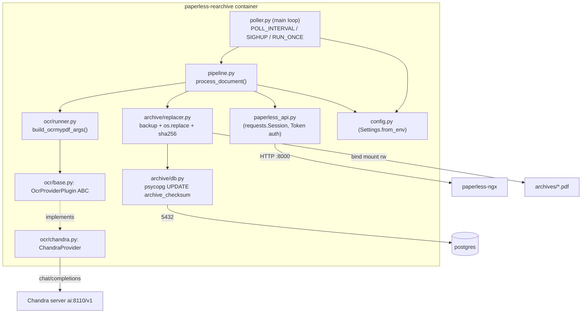
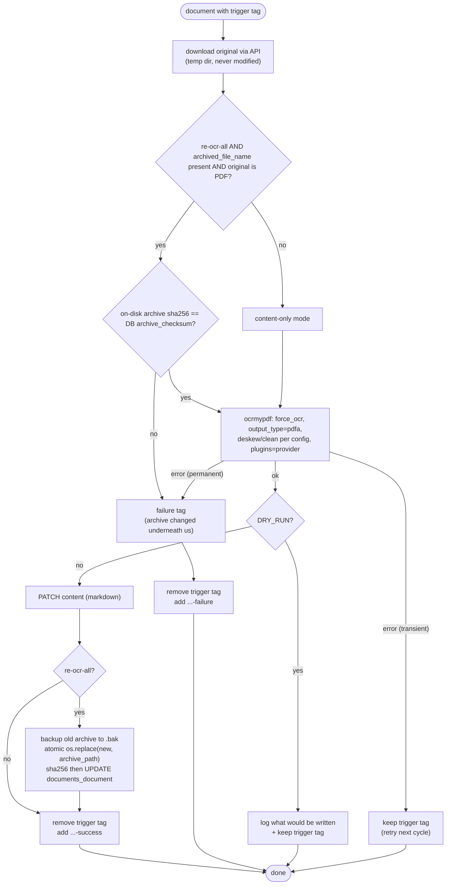

# paperless-rearchive — Planning

Working plan for the tag-driven re-OCR sidecar. This document is the source of truth for coding
agents; keep it up to date as phases complete. Status markers: ⬜ todo, 🔧 in progress, ✅ done.

## 1. Goal

Re-process the OCR of thousands of existing paperless-ngx documents using LLM vision OCR
(Chandra via the paperless-chandra ocrmypdf plugin), driven by tags:

- `re-ocr-content` — re-OCR, replace the document `content` field with the OCR output (markdown).
- `re-ocr-all` — as above, plus regenerate the archive version of the document and update the
  database checksum.

The original file is immutable; it is only downloaded via the API and used as OCR source.

## 2. Research notes (confirmed against paperless-ngx source / docs)

- **Archive checksum**: paperless sets `archive_checksum` with
  `documents.utils.compute_checksum` — **SHA-256** of the file bytes (verified live: the
  on-disk file's SHA-256 matches the DB value exactly; earlier paperless releases used MD5)
  when the archive is moved into `settings.ARCHIVE_DIR`. Correct update statement:
  `UPDATE documents_document SET archive_checksum = '<sha256>' WHERE id = <id>;`
- **Archive directory**: `media/documents/archive/` (singular) on this deployment, with
  template-derived subdirectories (e.g. `Retirement/Steffen Richter/2026/…pdf`);
  246 of 5352 documents have no archive file.
- **Archive filename**: *not* always `<id>.pdf`. `file_handling.generate_unique_filename(doc,
  archive_filename=True)` derives it from storage-path / `PAPERLESS_FILENAME_FORMAT` templates
  (or `<pk:07>.pdf` when no template). The sidecar must take the archive path from the API
  serializer field `archived_file_name` (relative to `ARCHIVE_DIR`) — never reconstruct it.
- **Born-digital PDFs**: in `auto` mode paperless skips OCR for PDFs with an existing text layer
  (`skip_text`, `pdf_born_digital_text`); `PAPERLESS_ARCHIVE_FILE_GENERATION`
  (`never`/`only`/`always`) decides whether an archive file is produced at all. Documents
  without an archive file ⇒ content-only mode in this sidecar.
- **Non-PDF originals** (jpg/png/tiff/…): paperless converts them to a PDF during consumption
  (`PAPERLESS_OCR_IMAGE_DPI`, A4 DPI fallback). The sidecar runs the same conversion via
  ocrmypdf but cannot regenerate an *existing* archive file (none exists) ⇒ content-only by
  default; `REARCHIVE_ARCHIVE_FOR_IMAGES=true` later opts into creating one (experimental).
- **API limits**: the paperless REST API cannot upload/replace an archive version of an existing

## 3. Architecture



### Plugin architecture

An `OcrProviderPlugin` encapsulates everything LLM-specific:

- `name` — provider id (`REARCHIVE_PROVIDER=chandra`).
- `ocrmypdf_plugin_module` — module passed as `plugins=[...]` to `ocrmypdf.ocr()`
  (paperless-chandra ships `paperless_chandra.ocrmypdf_plugin`, which registers `--chandra-*`
  kwargs and returns the Chandra `OcrEngine`).
- `ocrmypdf_kwargs()` — provider settings forwarded as ocrmypdf kwargs
  (server URL, model name, API key, max tokens, content format).
- `validate()` — fail-fast configuration probe (paperless-chandra already probes the server in
  its `check_options` hookimpl).

Because ocrmypdf renders the invisible text layer from the engine's hOCR and writes the
sidecar text (markdown when `content_format=markdown`), a future provider only needs its own
ocrmypdf `OcrEngine` + plugin module. Reusable paperless-chandra pieces for new providers:
`engine/hocr.py` (typed page model + hOCR serialisation), `engine/pdf.py` (text-only PDF
rendering), `engine/geometry.py`, `engine/blocks.py`.

### Per-document flow



## 4. Repository layout

```
paperless-rearchive/
├── README.md                  # living overview + status
├── doc/
│   ├── PLANNING.md            # this file
│   └── deploy/compose-snippet.yml
├── paperless_rearchive/
│   ├── __init__.py
│   ├── config.py              # env-driven Settings
│   ├── paperless_api.py       # REST client
│   ├── pipeline.py            # per-document orchestration
│   ├── poller.py              # main loop (entry point)
│   ├── ocr/
│   │   ├── __init__.py
│   │   ├── base.py            # OcrProviderPlugin ABC + registry
│   │   ├── chandra.py         # Chandra provider
│   │   └── runner.py          # Django-free ocrmypdf argument builder + image helpers
│   └── archive/
│       ├── __init__.py
│       ├── db.py              # psycopg checksum update
│       └── replacer.py        # backup + atomic replace + sha256
├── docker/Dockerfile
├── pyproject.toml
└── tests/
```

## 5. Phases

### Phase 1 — Documentation & scaffold ✅
- ✅ README.md, PLANNING.md, diagrams
- ✅ package scaffold, pyproject, Dockerfile, compose snippet

### Phase 2 — Core plumbing ✅
- ✅ `config.py` Settings
- ✅ `paperless_api.py` (ensure_tag, doc_ids_with_tag, download, patch content, tag swap)
- ✅ `ocr/base.py` ABC + provider registry (validated live against local paperless-chandra)

### Phase 3 — OCR pipeline ✅
- ✅ `ocr/chandra.py` provider (wraps paperless-chandra ocrmypdf plugin)
- ✅ `ocr/runner.py` (force_ocr, pdfa, deskew/clean, image DPI/alpha handling, fallback retry)
- ✅ `pipeline.py` orchestration incl. dry-run + tag lifecycle

### Phase 4 — Archive replacement ✅
- ✅ `archive/db.py` (psycopg; fetch + update archive_checksum)
- ✅ `archive/replacer.py` (verify checksum, backup, atomic replace, sha256)
- ✅ DB password from secret file `paperless_db_paperless_passwd`

### Phase 5 — Deployment & tests 🔧
- ✅ Dockerfile (python:3.14-slim/trixie + ghostscript/tesseract/qpdf/pngquant/jbig2/poppler +
  ocrmypdf + paperless-chandra from git master; image builds and all deps import on 3.14)
- ✅ compose snippet + `.env.example`
- ✅ unit tests (12 passing: replacer, runner args, config)
- ✅ live smoke test (2026-09-15): dry-run cycle against the running instance
  (`http://localhost:8001`) — document 5488 tagged `re-ocr-content` + `re-ocr-all` was OCR'd
  end-to-end via the live Chandra server (~30k chars markdown sidecar produced, nothing
  written, trigger tag kept). Dry-run never touches tags — enforced in `pipeline`.
- ✅ in-container e2e of the OCR stage (`tests/size_compare.py`, run on the `backend` network
  with real DB + API access): DB path resolution via `fetch_archive_filename`, checksum
  verification, full ocrmypdf+Chandra run.
- ✅ `REARCHIVE_OCR_MODE=auto` added: redo_ocr (text layer present) vs force_ocr.
- ⬜ archive size investigation (see Risks): old CCITT-bilevel archives can grow up to ~8×
  when force_ocr rasterises pages (doc 3723: 112 KiB → 900 KiB; redo_ocr did not shrink it —
  root cause not yet confirmed). Real-scanned doc 3697 stayed at 1.00×. Debug before mass
  re-OCR of `re-ocr-all`.
- ⬜ repeat-loop detection: treat documents whose Chandra logs show repeated
  `Detected repeat token, retrying generation` as failed scans (tag `-failure` / investigate).
- ⬜ full e2e incl. writes: tag one throwaway `re-ocr-all` document; verify archive replace +
  `archive_checksum` UPDATE + tag lifecycle (all read-only paths already validated).

  document (no archive upload endpoint; document upload creates *new* documents). Hence the
  bind-mount + direct DB update approach.
- **Content update**: `PATCH /api/documents/{id}/ { "content": "..." }` works (documents
  serializer exposes `content` as writable).
- **Live probe (2026-09-15, instance with 5352 docs)**:
  - the serializer exposes `archived_file_name`, but it is a **flattened download/display name**
    (spaces instead of template subdirectories) — the real on-disk path lives **only in the DB**
    (`documents_document.archive_filename`, e.g. `House/1925/…pdf`). The sidecar resolves the
    archive path via `archive/db.py: fetch_archive_filename`.
  - the serializer does **not** expose `archive_checksum` — read directly from Postgres
    (`archive/db.py: fetch_archive_checksum`).
  - 246 of 5352 documents have no archive file.
- **Archive directory**: `media/documents/archive/` (singular) on this deployment, with
  template-derived subdirectories.
- **Chandra repeat-loop = failed scan**: when the vLLM/Chandra server logs
  `Detected repeat token, retrying generation (attempt N)` and the GPU spins up, the model is
  looping on a bad/empty page. Treat documents whose logs show repeated retries as *failed*
  OCR runs (quality is garbage even if the pipeline completes). Detailed handling (e.g.
  aborting a document after N retries at the pipeline level) is deferred — see Risks.
- **Base image**: paperless-ngx now ships `python:3.14-slim` (Debian 13 *trixie*) — this
  sidecar uses the same base. `jbig2` (bilevel compression for ocrmypdf) is available as an
  apt package in trixie and is installed directly (~15% size saving measured on a real scan).


## 6. Configuration

Environment variables (prefix `REARCHIVE_` where generic; `PAPERLESS_CHANDRA_*` shared with the
paperless container for provider settings):

| Variable | Default | Description |
| --- | --- | --- |
| `PAPERLESS_BASE_URL` | `http://paperless:8000` | paperless-ngx base URL |
| `PAPERLESS_API_TOKEN` | *(required)* | API token (from `.env.paperless-gpt`) |
| `REARCHIVE_TRIGGER_TAG_CONTENT` | `re-ocr-content` | trigger tag, content-only mode |
| `REARCHIVE_TRIGGER_TAG_ALL` | `re-ocr-all` | trigger tag, archive + content mode |
| `REARCHIVE_SUCCESS_SUFFIX` | `-success` | success tag suffix |
| `REARCHIVE_FAILURE_SUFFIX` | `-failure` | failure tag suffix |
| `REARCHIVE_ARCHIVE_DIR` | `/archives` | bind-mounted `media/documents/archive` |
| `REARCHIVE_PROVIDER` | `chandra` | OCR provider plugin |
| `PAPERLESS_CHANDRA_SERVER_URL` | *(required)* | e.g. `http://ai:8110/v1` |
| `PAPERLESS_CHANDRA_MODEL_NAME` | `chandra` | e.g. `chandra-ocr-2-q8` |
| `PAPERLESS_CHANDRA_API_KEY_FILE` | *(optional)* | secret file with API key |
| `PAPERLESS_CHANDRA_CONTENT_FORMAT` | `markdown` | `markdown` or `text` |
| `PAPERLESS_CHANDRA_MAX_OUTPUT_TOKENS` | `12384` | per-page token budget |
| `REARCHIVE_OCR_LANGUAGE` | `eng` | passed through to ocrmypdf (labels hOCR) |
| `REARCHIVE_OCR_MODE` | `auto` | `auto`: `redo_ocr` when the PDF has a text layer (keeps original page images), `force_ocr` otherwise; `force`: always rasterise + re-OCR; `redo`: always redo |
| `REARCHIVE_OCR_DESKEW` | `true` | deskew pages before OCR |
| `REARCHIVE_OCR_OUTPUT_TYPE` | `pdfa` | archive PDF/A flavour |
| `REARCHIVE_OCR_USER_ARGS` | *(unset)* | extra ocrmypdf kwargs (JSON), e.g. paperless `PAPERLESS_OCR_USER_ARGS` |
| `REARCHIVE_ARCHIVE_FOR_IMAGES` | `false` | experimental: create archive for non-PDF originals |
| `REARCHIVE_POLL_INTERVAL` | `300` | seconds between polls |
| `REARCHIVE_BATCH_LIMIT` | `5` | max documents per cycle |
| `REARCHIVE_OCR_CONCURRENCY` | `2` | page-level concurrency inside ocrmypdf (jobs) |
| `REARCHIVE_MAX_PAGES` | `0` | abort documents with more pages (0 = unlimited) |
| `REARCHIVE_DRY_RUN` | `false` | OCR + report only, no writes |
| `REARCHIVE_RUN_ONCE` | `false` | single cycle then exit |
| `REARCHIVE_LOG_LEVEL` | `INFO` | log level |
| `PAPERLESS_DBHOST` / `PAPERLESS_DBPORT` / `PAPERLESS_DBNAME` / `PAPERLESS_DBUSER` | `postgres` / `5432` / `paperless` / `paperless` | DB connection |
| `PAPERLESS_DBPASS_FILE` | *(required for re-ocr-all)* | secret file with DB password |

Secrets (already defined in `paperless-lxc/docker-compose.yml`): `chandra_api_key`,
`paperless_db_paperless_passwd`.

## 7. Risks / open questions

- ⬜ Verify `archived_file_name` serializer field name against the running instance's API
  (`/api/documents/{id}/`) during Phase 5 e2e.
- ⬜ Full-text index / search index is updated by paperless on content PATCH (serializers post
  save) — confirm search reflects new content after e2e.
- ⬜ Thumbnails are not regenerated (archive pixel content is unchanged, so the existing
  thumbnail stays valid).
- ⬜ Concurrency with paperless workers: the checksum-verify-before-replace step is the only
  guard against concurrent modification — acceptable for a single-operator instance.
- ⬜ `invalidate_digital_signatures: true` (paperless `PAPERLESS_OCR_USER_ARGS`) must be
  mirrored in sidecar runs for signed PDFs.
- ⬜ **Archive size regression on old bilevel scans** (`re-ocr-all`): doc 3723 (1925 CCITT-scan)
  grew 112 KiB → ~900 KiB even with `redo_ocr`; doc 3697 stayed 1.00×. Suspected: force/redo
  rasterisation transcodes 1-bit images to grey, and/or LLM repeat-loop text bloat. Debug with
  `pdfimages -list` on old vs new archives before bulk `re-ocr-all`.
- ⬜ **Failed-scan detection**: Chandra `Detected repeat token, retrying generation` + GPU spin
  indicates the model looping on a bad/empty page — effectively a failed OCR. Pipeline should
  detect this (client callback / output repetition heuristic) and mark `-failure` instead of
  writing garbage content. Deferred until observed on more documents.
- ⬜ paperless-chandra is installed from git `master` (no release tags published upstream yet);
  pin a tag once available for reproducible builds.
